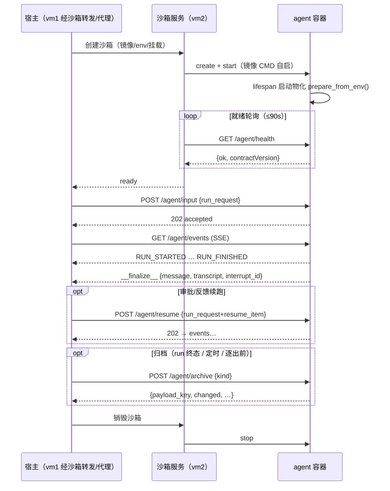

# Agent 容器契约（Agent Contract）v1.0

> 状态：Normative · 读者：agent 开发者 / 平台工程
> 机器可校验 schema：`protocol/schemas/agent-contract.schema.json`（JSON Schema 2020-12）
> 关联：`protocol/agent-protocol.md`（AG-UI 事件层定义）、`protocol/sandbox-lifecycle.md`（沙箱生命周期 API）、`protocol/http-api.md`（前端契约）、`protocol/agent-onboarding.md`（如何做一个合规 agent 并接入）
>
> **本文档如实固化 2026-07 现网行为**（v1.0 不借机重新设计）；改进走 minor 版本 + 协商字段。

---

## 0. 契约定位

本契约定义**宿主（应用层）与容器内 agent 服务之间**的 HTTP/SSE 数据面协议。任何实现本契约的镜像都可作为 agent 接入沙箱系统，无需改动平台代码。

```
应用层（vm1 会话管理）──HTTP/SSE──► 沙箱服务（vm2，透传/转发）──HTTP/SSE──► 容器内 agent 服务（本契约）
```

- 沙箱服务对本契约的内容**零感知**（目标态经通用代理透传；过渡期逐端点转发）。
- 事件流的**事件结构**由 `agent-protocol.md` / `agent-protocol.schema.json` 定义（AG-UI 采用集）；本契约只约定**传输端点与信封语义**。

### 0.1 版本与协商

- 本契约版本：**`1.0`**（`major.minor`）。
- agent 必须在 `GET /agent/health` 响应中返回 `contractVersion` 字段。
- 宿主/沙箱在健康检查时读取：**major 不匹配 → 拒绝接入**（`agent_contract_mismatch`）；minor 落后 → 允许但告警。
- 未返回 `contractVersion` 的 agent 视为 legacy（等价 `1.0`），过渡期兼容，一个大版本后拒绝。

### 0.2 通用核心 vs 扩展（extensions）

请求/响应字段分两档：

- **核心字段（normative）**：任何领域的 agent 都必须理解/实现。
- **扩展字段（extensions，informative）**：领域私有语义，合规 agent 可忽略未知扩展字段、**不得因未知字段报错**。本仓税务 agent 的 `enterprise_id` / `period` / `template` / `viewing` / `references` 等即扩展字段（标注 `[tax]`）。

> v1.0 中扩展字段仍平铺在请求体顶层（如实描述现状）；v1.1 计划收拢进显式 `extensions` 对象。

---

## 1. 传输与进程模型

| 项 | 约定 |
| --- | --- |
| 监听 | 容器内 HTTP 服务监听 `0.0.0.0:${AGENT_PORT}`（默认 **8080**） |
| 启动 | 镜像自带入口（CMD/ENTRYPOINT）拉起服务；宿主不注入启动命令（legacy 模式除外，见 `sandbox-lifecycle.md`） |
| 就绪 | 宿主轮询 `GET /agent/health` 直至 `ok=true`（默认超时 90s，间隔 0.5s）；超时即判 `agent_not_ready` 并停容器 |
| 并发 | **单容器单活跃 run**：有活跃 run 时新 input/resume 返回 409 `run_busy` |
| 工作区 | 宿主会话根 bind mount 到 `/session`；`/session/workspace` 为业务工作区，agent 对其有全量读写权 |
| 认证 | 容器内端点不做鉴权（网络边界由沙箱服务保证：bridge 网络 + egress 白名单） |

## 2. 端点总览

| 方法 | 路径 | 语义 | 成功码 | 错误码 |
| --- | --- | --- | --- | --- |
| GET | `/agent/health` | 健康 + 忙闲 + 契约版本 | 200 | — |
| POST | `/agent/input` | 提交 run_request，后台执行 | 202 | 409 `run_busy`、502 `materialize_failed` |
| POST | `/agent/resume` | 提交续跑（与 input 同形） | 202 | 409、502 同上 |
| POST | `/agent/cancel` | 取消活跃 run（幂等） | 200 | — |
| GET | `/agent/events` | SSE 事件流（当前/最近一次 run） | 200 | —（错误以 RUN_ERROR 入流） |
| POST | `/agent/materialize` | 工作区物化（幂等） | 200 | 400 参数错、502 `materialize_failed` |
| POST | `/agent/archive` | 工作区归档到对象存储 | 200 | 400 参数错、502 `archive_failed` |

### 2.1 `GET /agent/health`

响应：

```jsonc
{
  "ok": true,
  "busy": false,            // 是否有活跃 run
  "run_id": null,           // busy=true 时为活跃 run id
  "contractVersion": "1.0"  // 本契约版本（v1.0 起必须）
}
```

### 2.2 `POST /agent/input` — run_request

宿主投递一次 run。agent 收到后**立即返回 202**（`{"status":"accepted","run_id":...}`），在后台线程执行；执行产物经 `/agent/events` 流出。

请求体（`RunRequest`）：

| 字段 | 类型 | 档位 | 语义 |
| --- | --- | --- | --- |
| `run_id` | string | 核心·必填 | 本次 run 的唯一 id（宿主生成） |
| `session_id` | string | 核心·必填 | 会话 id |
| `conversation_id` | string? | 核心 | 对话 id（多对话隔离）；缺省取 `session_id` |
| `thread_id` | string? | 核心 | AG-UI threadId（事件流回带） |
| `user_text` | string | 核心 | 用户输入文本（resume 时可为空，由 `resume_item` 派生指令） |
| `history` | object[]? | 核心 | 模型侧对话历史（宿主装载；agent 不自行持久化对话） |
| `model` | string? | 核心 | 模型标识（经 LLM proxy 解析） |
| `owner_id` | string? | 核心 | 归属用户（数据面归档/物化用） |
| `workspace` | string | 核心 | 工作区路径，容器内恒为 `"/session/workspace"` |
| `resume_item` | object? | 核心 | 非空即 resume 语义：agent 自行 apply（落盘副作用）+ 合成续跑指令；结构见 `agent-protocol.schema.json#/$defs/ResumeItem` |
| `mode` | string? | 核心 | 运行模式（`agent` 默认 / `plan`） |
| `new_plan` | boolean | 核心 | 强制新开计划任务 |
| `shell_timeout` | number | 核心 | 单命令超时秒（默认 30） |
| `output_limit` | integer | 核心 | 工具输出截断字节（默认 8000） |
| `enterprise_id` | string | **[tax] 扩展** | 企业 id（播种/上下文） |
| `period` | string | **[tax] 扩展** | 所属期 |
| `viewing` | string? | **[tax] 扩展** | 用户正在查看的文件（弱上下文） |
| `references` | array? | **[tax] 扩展** | 用户圈定的强上下文（`$defs/Reference`） |

响应 202：`{"status": "accepted", "run_id": "<run_id>"}`

前置行为（normative）：接受前 agent 必须保证工作区已物化（幂等兜底，等价 `POST /agent/materialize` 缺省参数）；物化失败返回 502 `materialize_failed`，**不得**在空盘上开跑。

### 2.3 `POST /agent/resume`

与 `/agent/input` **同形同语义**（宿主已把审批/反馈编进 `resume_item` / `user_text`）。区分端点仅为语义可读性与审计。

### 2.4 `POST /agent/cancel`

请求：`{"run_id": "r-123"}`（可选；缺省取消当前活跃 run）。

幂等语义：无活跃 run / run 已结束 / `run_id` 不匹配 → `{"ok":true,"cancelled":false}`（no-op）；命中 → 置取消信号，agent 在轮次/流式边界优雅收尾并向事件流发 `RUN_CANCELLED`，响应 `{"ok":true,"cancelled":true,"run_id":...}`。

### 2.5 `GET /agent/events` — SSE 事件流

- `Content-Type: text/event-stream`；每帧 `data: <JSON>\n\n`。
- 流内容 = **当前活跃 run**（或最近一次已结束 run 的缓冲回放）的全量事件，直到终止。
- 事件结构：AG-UI 采用集（见 `agent-protocol.md` §3；`RUN_STARTED`/`TEXT_MESSAGE_*`/`TOOL_CALL_*`/`REASONING_*`/`ACTIVITY_*`/`RUN_FINISHED`/`RUN_ERROR`/`RUN_CANCELLED`，含 `seq`）。
- **错误入流**：执行异常不改变 HTTP 状态，以 `{"type":"RUN_ERROR","content":...,"seq":N}` 事件表达；无任何 run 时流只含一帧 `RUN_ERROR{content:"no_active_run"}`。
- **收尾帧 `__finalize__`**（本契约私有信封，非 AG-UI 事件）：终止事件之后、流关闭之前必须发出：

```jsonc
{
  "type": "__finalize__",
  "status": "completed" | "error" | "cancelled",
  "message": { /* 持久化层 Message{info,parts[]}，宿主据此落库 */ },
  "transcript": [ /* 模型侧忠实对话增量，宿主并入 history */ ],
  "interrupt_id": "itr-1" | null   // 非空时宿主须把会话置 WAITING（审阅期保护）
}
```

- 帧序：`RUN_STARTED … 终止事件(RUN_FINISHED|RUN_ERROR|RUN_CANCELLED) → __finalize__ → 流关闭`。

### 2.6 `POST /agent/materialize`

工作区物化（**幂等**：工作区含 `.agent/materialized.json` 标记则跳过，除非 `force=true`）。

请求（所有字段可缺省，缺省读容器 env）：

| 字段 | 档位 | 语义 |
| --- | --- | --- |
| `payload_key` | 核心 | 非空 → 从对象存储恢复快照（旧会话）；空 → 走播种分支（新会话） |
| `owner_id` / `session_id` | 核心 | payload 恢复必需 |
| `workspace` | 核心 | 缺省 `$WORKSPACE`（`/workspace`） |
| `force` | 核心 | 忽略幂等标记强制重物化 |
| `enterprise_id` / `period` / `template` | **[tax] 扩展** | 播种分支：按企业 id 拉数据 + 落知识库；`template="empty"` 只建骨架 |

响应 200：

```jsonc
{
  "mode": "payload" | "enterprise" | "skipped",
  "bytes_loaded": 10240,
  "inputs": ["inputs/vouchers.csv"] | null,   // [tax] 播种分支产物清单
  "payload_key": "…" | null,
  "detail": "loaded_from_minio"
}
```

### 2.7 `POST /agent/archive`

把工作区归档到对象存储（数据面在 agent 进程内直连，宿主/沙箱不参与传输）。

请求：

| 字段 | 档位 | 语义 |
| --- | --- | --- |
| `kind` | 核心 | `"draft"`（草稿兜底）/ `"version"`（显式版本） |
| `owner_id` / `session_id` | 核心 | 缺省读容器 env（`OWNER_ID`/`SESSION_ID`），均无则 400 |
| `workspace` | 核心 | 缺省 `$WORKSPACE` |
| `version_id` / `draft_id` / `project_id` | **[tax] 扩展** | 归属账本键（宿主入账用；agent 原样回带） |

响应 200（`ArchiveResult`）：

```jsonc
{
  "payload_key": "users/u1/sessions/s1/payload/….tar.gz",
  "changed": true,            // 与上次归档内容级比较；false = 无变化跳过上传
  "payload_bytes": 20480,
  "kind": "draft",
  "version_id": null,
  "draft_id": "s1",
  "project_id": "p1",
  "refcount_deltas": [ { "blob_sha": "…", "delta": 1, "size_bytes": 1024 } ],  // [tax] blob 引用计数增量
  "blob_shas": ["…"]          // [tax] 该 payload 引用的全量 uploads blob
}
```

归档必须支持**内容级查重**：与上次归档（含 payload 恢复后的基线）无差异时 `changed=false` 且不重复上传。

---

## 3. 生命周期时序



## 4. 环境变量契约

沙箱服务在容器启动时注入（agent 只读）：

| 变量 | 档位 | 语义 |
| --- | --- | --- |
| `AGENT_PORT` | 核心 | HTTP 监听端口（缺省 8080） |
| `WORKSPACE` | 核心 | 工作区路径（`/session/workspace`） |
| `DEBUG_DIR` | 核心 | 调试产物目录（`/session/debug`） |
| `SESSION_ID` / `OWNER_ID` | 核心 | 会话/归属身份（物化归档缺省值） |
| `PROJECT_ID` | 核心 | 项目归属（可缺省） |
| `PAYLOAD_KEY` | 核心 | 非空 → 启动物化走快照恢复 |
| `AGENT_TOKEN` | 核心 | 会话级 token（回调宿主的 Bearer） |
| `LLM_BASE_URL` | 核心 | LLM proxy 地址（宿主侧代理，**永不注入真实 LLM key**） |
| `LLM_API_KEY` | 核心 | = `AGENT_TOKEN`（proxy 验 token 换真 key） |
| `LLM_MODEL` / `LLM_DIALECT` / `LLM_TEMPERATURE` | 核心 | 模型缺省参数 |
| `MINIO_ENDPOINT` / `MINIO_ACCESS_KEY` / `MINIO_SECRET_KEY` / `MINIO_SECURE` / `MINIO_DEFAULT_BUCKET` / `MINIO_REGION` | 核心 | 对象存储凭据（materialize/archive 数据面直连） |
| `ENTERPRISE_ID` / `PERIOD` / `TEMPLATE` | **[tax] 扩展** | 播种参数（v1.1 目标：改由应用层经不透明 env map 透传） |

**禁止注入**：真实 LLM API key、平台服务间 token（`VM2_SERVICE_TOKEN`）、数据库凭据。

## 5. 文件系统契约

- `/session` 为会话持久化数据面；业务工具和文件 API 仍只加载 `/session/workspace`。
- 目录骨架（物化时创建）：`inputs/`（企业数据）、`knowledge/`（知识库）、`uploads/`（用户上传，归档时按内容 sha 去重为 blob）、`.agent/`（agent 私有状态：`materialized.json` 物化标记、`archive-manifest.json` 归档查重基线、任务/覆盖状态等）。
- payload v2 归档范围：`/session/workspace`、`/session/debug` 与会话根下点前缀条目；上传字节仍按 blob 存储。

## 6. 合规性（Conformance）

判定一个镜像是「合规 agent」的最小标准（conformance suite 黑盒验证，见 `tests/agent_conformance/`）：

1. 镜像自带入口，起容器后 `GET /agent/health` 在 90s 内 `ok=true` 且带 `contractVersion` major = 1；
2. `POST /agent/input` → 202；重复提交（活跃期）→ 409 `run_busy`；
3. `GET /agent/events` 流出合法 AG-UI 事件序列，以终止事件 + `__finalize__` 收尾，流正常关闭；
4. `POST /agent/cancel` 幂等，取消后事件流以 `RUN_CANCELLED` 终止；
5. `POST /agent/materialize` 幂等（二次调用 `mode="skipped"`）；
6. `POST /agent/archive` 返回 `payload_key`，且以该 key 重新 materialize 可恢复等价工作区；无变化二次归档 `changed=false`；
7. 对未知扩展字段不报错。
