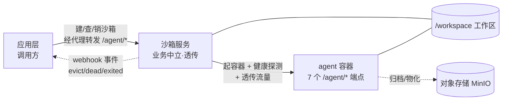
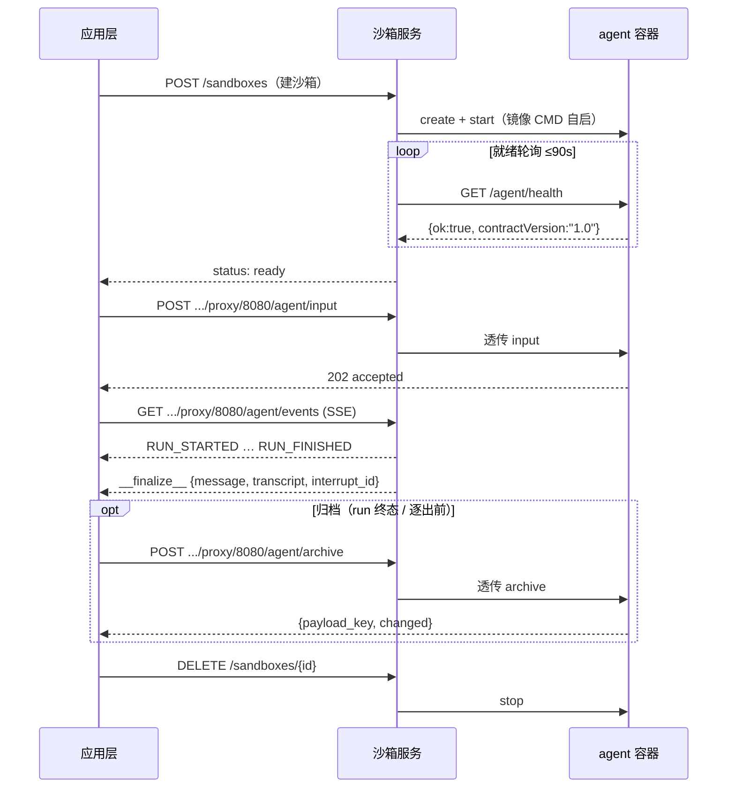

# 应用集成指南(新手版)

> 状态:Informative · 读者:第一次把应用/agent 接入本沙箱服务的新手开发者
> 权威契约:[`agent-contract.md`](../agent-contract.md) · [`sandbox-lifecycle.md`](../sandbox-lifecycle.md)(Normative)
> 参考实现:[`echo_agent/`](../../echo_agent/)(零业务最小合规 agent,可直接照抄)

## 0. 这份指南怎么用

- **谁该读**:想把**自己的 agent** 或**自己的应用**接入本沙箱服务、又第一次接触的人。
- **读完能干嘛**:不动平台一行代码,把一个合规 agent 跑起来,让应用层能建沙箱、跟 agent 对话、用完回收。
- **先决条件**:会用 Docker 基本命令;手上有一个 `SERVICE_TOKEN`(找运维要)。
- **怎么看**:从头到尾顺着读是一整条路;急着查接口直接跳 §7 契约速查表。

## 1. 它是什么

一句话:**给 agent 一个隔离的容器 + 一块工作区,把流量原样代理进去,其余一概不管。** 因为它不认识任何业务,任何遵守契约的 agent 都能直接跑。

系统分三层,各管各的:

| 层 | 是谁 | 管 | 不管 |
| --- | --- | --- | --- |
| 应用层(调用方) | 你的应用后台 | 建沙箱/销毁、经代理跟 agent 对话、消费事件、用完回收 | 不碰容器内部 |
| 沙箱服务 | 本服务 | 容器生命周期、通用代理(含 SSE 流式)、工作区快照、被动事件通知 | 不解析 agent 协议内容、不主动调你的后端 |
| agent 容器 | 你的 agent 镜像 | 跑业务、发事件、物化/归档工作区 | 不自行管容器生死 |

两条契约把边界钉死:
- **agent 契约**([`agent-contract.md`](../agent-contract.md)):容器内 agent 要实现的 7 个 `/agent/*` 端点。
- **沙箱生命周期契约**([`sandbox-lifecycle.md`](../sandbox-lifecycle.md)):应用层调沙箱服务的北向 API。



## 2. 先跑通参考实现(建立体感)

先不写自己的代码。仓库自带一个零业务的最小合规 agent `echo_agent`,用它跑一遍端到端冒烟,看到「建沙箱 -> 代理 -> SSE -> 工作区 -> 生命周期」全链路通,你就有体感了:

```bash
docker compose -f deploy/docker-compose.smoke.yml up -d --build
bash deploy/smoke.sh
docker compose -f deploy/docker-compose.smoke.yml down
```

`smoke.sh` 全绿 = 链路没问题。后面把你自己的 agent 换进来即可。

## 3. 做你的 agent

### 3.1 你要交付什么

一个**自带入口(CMD/ENTRYPOINT)的容器镜像**:容器内起一个 HTTP 服务,监听 `0.0.0.0:${AGENT_PORT}`(默认 8080),实现这 7 个端点(细节见 [`agent-contract.md`](../agent-contract.md) §2):

| 方法 | 路径 | 一句话行为 |
| --- | --- | --- |
| GET | `/agent/health` | 返回 `{ok, busy, run_id, contractVersion:"1.0"}` |
| POST | `/agent/input` | 收 RunRequest,**立即 202**,后台执行;活跃期重复 -> 409 |
| POST | `/agent/resume` | 续跑(同 input,宿主已把审批编进 resume_item) |
| POST | `/agent/cancel` | 幂等取消;事件流以 `RUN_CANCELLED` 收尾 |
| GET | `/agent/events` | SSE:`RUN_STARTED … 终止事件 -> __finalize__ -> 关流` |
| POST | `/agent/materialize` | 工作区物化,**幂等**(二次 `mode="skipped"`) |
| POST | `/agent/archive` | 归档到对象存储,返回 `payload_key` + 内容级 `changed` |

### 3.2 最短路径:抄 echo_agent

`echo_agent/app.py`(~150 行)是可运行的最小骨架:全 7 端点、正确的 SSE 帧序与 `__finalize__` 收尾、单容器单活跃 run、materialize 幂等。直接以它为模板,通常只改三处:

- `/agent/input` 后台 worker:把「echo 一句话」换成你真正的 run(调 LLM、跑工具、发事件);
- `/agent/materialize`:新会话按需播种、旧会话按 `payload_key` 从对象存储恢复(echo 直接 `skipped`);
- `/agent/archive`:把 `/workspace` 打包上传对象存储并返回 `payload_key`(echo 是 stub)。

### 3.3 运行环境(沙箱注入,agent 只读)

容器启动时沙箱服务注入 env,你的 agent 只读使用,分几类:

- **身份**:`SESSION_ID` / `OWNER_ID` / `PROJECT_ID` / `PAYLOAD_KEY`;
- **路径**:`WORKSPACE=/workspace`(唯一持久面)、`DEBUG_DIR=/tmp/debug`;
- **LLM**(经宿主 proxy,**永不给真实 key**):`LLM_BASE_URL`、`LLM_API_KEY`(= `AGENT_TOKEN`)、`LLM_MODEL`;
- **对象存储**(数据面直连):`MINIO_ENDPOINT` / `MINIO_ACCESS_KEY` / `MINIO_SECRET_KEY` / `MINIO_DEFAULT_BUCKET`。

要点:你的 agent**不自行持久化对话历史**(宿主经 `history` 装载、`__finalize__` 回收)。不需要 LLM/MinIO 的纯工具型 agent,忽略对应 env 即可。

### 3.4 构建镜像(关键:自带入口)

镜像必须**自启服务**(沙箱默认不注入启动命令)。参照 `echo_agent/Dockerfile`:

```dockerfile
FROM python:3.12-slim
WORKDIR /srv
COPY your_agent/requirements.txt /tmp/req.txt
RUN pip install --no-cache-dir -r /tmp/req.txt
COPY your_agent /srv/your_agent
ENV PYTHONPATH=/srv AGENT_PORT=8080 WORKSPACE=/workspace
EXPOSE 8080
CMD ["sh", "-c", "uvicorn your_agent.app:app --host 0.0.0.0 --port ${AGENT_PORT:-8080}"]
```

```bash
docker build -t your-agent:latest -f your_agent/Dockerfile .
```

### 3.5 一个 run 的生命周期

从建沙箱到销毁,一次完整对话长这样(细节见 [`agent-contract.md`](../agent-contract.md) §3):



关键:agent 收 input **立即 202**,活儿在后台跑,产物经 `/agent/events` SSE 流出;流末尾必有 `__finalize__` 信封(宿主据此落库);活跃期重复 input 返回 409。

### 3.6 验证合规(黑盒,换靶子即可)

平台提供黑盒 conformance,**直接打你的 agent**,无需信任你的内部实现:

```bash
# 起你的容器后,指向它跑 agent 契约套件
docker run -d --name my-agent -p 8080:8080 your-agent:latest
AGENT_BASE_URL=http://localhost:8080 python -m pytest tests/agent_conformance -q
```

全绿即「合规 agent」。合规最小标准见 [`agent-contract.md`](../agent-contract.md) §6:health 90s 就绪且契约版本 major=1、input 202/409、SSE 收尾、cancel 幂等、materialize 幂等、archive 可恢复 + 查重、忽略未知字段。

## 4. 应用层接线

### 4.1 鉴权与基址

- 基址:`http://<sandbox-service-host>:8001`。
- 鉴权:除 `GET /health` 外所有端点带 `Authorization: Bearer <SERVICE_TOKEN>`。

### 4.2 建沙箱

`POST /sandboxes`,关键字段:`id`(你的稳定标识,本仓场景=会话 id)、`env`(不透明透传,服务不解析)、`callback_url`(本沙箱事件回调,可选)。对同一 `id` 幂等--已有活容器直接复用。

```bash
curl -X POST http://localhost:8001/sandboxes \
  -H "Authorization: Bearer $SERVICE_TOKEN" \
  -d '{"id":"s-123","env":{"SESSION_ID":"s-123","AGENT_TOKEN":"…"},"callback_url":"https://app/hooks/sandbox"}'
```

### 4.3 跟 agent 说话(经通用代理)

应用层不直连容器,而是经沙箱服务的通用代理转发到容器内 `/agent/*`:

- 提交 run:`POST /sandboxes/{id}/proxy/8080/agent/input`
- 收事件流:`GET /sandboxes/{id}/proxy/8080/agent/events`(SSE 透传,不缓冲)

方法、请求体、响应、状态码全透传;容器不可达返回 502。agent 协议内容沙箱服务零感知。

### 4.4 用完回收(三层防线)

沙箱不会自己关容器,关不关最终由应用层是否调 `DELETE /sandboxes/{id}` 决定。三层防线:

| 防线 | 谁触发 | 干什么 | 你要做的 |
| --- | --- | --- | --- |
| L1 退出即销毁 | 应用层(业务事件) | 用户退出工作空间时主动 DELETE | **主路径,必须接** |
| L2 空闲兜底 | 沙箱通知 + 应用层消费 | 空闲超 TTL 发 `evict_candidate` webhook,你收到后**先归档再 DELETE** | 配 callback_url + 收 webhook + 轮询 `/capacity` 兜底 |
| L3 孤儿巡检 | 沙箱服务自管 | 回收账本外的残留容器 | 不用管 |

要点:L2 的 webhook 是**尽力而为**(可能丢),所以必须同时轮询 `GET /capacity` 兜底;`evict_candidate` 后**先经代理归档、成功再 DELETE**,归档失败不删,避免丢数据。

### 4.5 回收时序

```mermaid
sequenceDiagram
    participant App as 应用层
    participant SBX as 沙箱服务
    participant Agent as agent 容器
    Note over SBX: 空闲超 IDLE_TTL（默认 600s）
    SBX-->>App: webhook {kind:"evict_candidate", sandbox_id}
    App->>SBX: POST .../proxy/8080/agent/archive（先抢救归档）
    SBX->>Agent: 透传 archive
    Agent-->>App: {payload_key, changed}
    App->>SBX: DELETE /sandboxes/{id}（归档成功后再删）
    SBX->>Agent: stop
    Note over App: 归档失败不删，转重试/人工

## 5. 上线(只改 .env)

平台代码零改动,切换只动部署变量。改 `deploy/.env`:

```dotenv
AGENT_IMAGE=your-agent:latest
AGENT_COMMAND=          # 留空 = 用镜像 CMD
AGENT_PORT=8080
```

重启 `sandbox_service` 即生效。

> 版本协商:`/agent/health` 的 `contractVersion` major 必须 = 1,否则宿主判 `agent_contract_mismatch` 拒绝接入(见 [`agent-contract.md`](../agent-contract.md) §0.1)。

## 6. 接入验收清单

- [ ] 镜像自带 CMD，起容器 90s 内 `/agent/health` `ok=true` 且 `contractVersion` major=1
- [ ] `/agent/input` 202；活跃期重复 409 `run_busy`
- [ ] `/agent/events` 帧序合法，终止事件 + `__finalize__` 收尾、正常关流
- [ ] `/agent/cancel` 幂等，取消后 `RUN_CANCELLED`
- [ ] `/agent/materialize` 幂等（二次 `skipped`）
- [ ] `/agent/archive` 返回 `payload_key`，以该 key 重物化可恢复等价工作区；无变化 `changed=false`
- [ ] 忽略未知扩展字段不报错
- [ ] `tests/agent_conformance`（打你的镜像）全绿 + `smoke.sh` 全绿
- [ ] 只改 `AGENT_IMAGE` 即接入，平台代码零改动

## 7. 契约速查表(AI 友好)

> **给 coding agent**:实现/对接以本表为最小契约;与 normative 文档冲突时,以 [`agent-contract.md`](../agent-contract.md) / [`sandbox-lifecycle.md`](../sandbox-lifecycle.md) 为准。机器可校验 schema 见 `docs/schemas/`,样例见 `docs/fixtures/`。

**表 1 · agent-contract 7 个端点**

| 方法 | 路径 | 成功 | 错误 | 行为 |
| --- | --- | --- | --- | --- |
| GET | `/agent/health` | 200 | — | `{ok, busy, run_id, contractVersion:"1.0"}` |
| POST | `/agent/input` | 202 | 409 `run_busy`、502 `materialize_failed` | 收 RunRequest,立即 202,后台执行 |
| POST | `/agent/resume` | 202 | 同上 | 续跑(同形,宿主已编入 resume_item) |
| POST | `/agent/cancel` | 200 | — | 幂等;命中后事件流以 `RUN_CANCELLED` 收尾 |
| GET | `/agent/events` | 200 | — | SSE:`RUN_STARTED…终止事件->__finalize__->关流` |
| POST | `/agent/materialize` | 200 | 400、502 | 工作区物化,幂等(二次 `mode="skipped"`) |
| POST | `/agent/archive` | 200 | 400、502 | 归档到对象存储,返回 `payload_key` + 内容级 `changed` |

**表 2 · sandbox-lifecycle 关键端点**(除 `GET /health` 外均需 `Authorization: Bearer <SERVICE_TOKEN>`)

| 方法 | 路径 | 行为 |
| --- | --- | --- |
| GET | `/health` | `{ok, apiVersion}`(公开) |
| GET | `/capacity` | 池统计 `{live, leased, idle, capacity, idleTtl, evict_candidates[]}` |
| POST | `/images` | 镜像预热(异步 202,幂等) |
| POST | `/sandboxes` | 创建/幂等复用;body 含 `id`/`env`/`callback_url?`/`wait_ready?` |
| GET | `/sandboxes/{id}` | 状态 `{state, running, exit_code, probe?}` |
| DELETE | `/sandboxes/{id}` | 停容器(幂等);`{ok, terminated}` |
| ANY | `/sandboxes/{id}/proxy/{port}/{path...}` | 通用透传(含 SSE);容器不可达 502 |
| POST | `/sandboxes/{id}/workspace/snapshot/restore` | 按 `payload_key` 恢复工作区;不存在 404 |

**表 3 · 关键注入 env**(沙箱启动注入,agent 只读)

| 变量 | 语义 |
| --- | --- |
| `AGENT_PORT` | HTTP 监听端口(缺省 8080) |
| `WORKSPACE` | 工作区路径(`/workspace`,唯一持久面) |
| `SESSION_ID` / `OWNER_ID` | 会话/归属身份 |
| `PAYLOAD_KEY` | 非空→物化走快照恢复 |
| `AGENT_TOKEN` | 会话级 token(= `LLM_API_KEY`,回调宿主 Bearer) |
| `LLM_BASE_URL` / `LLM_API_KEY` / `LLM_MODEL` | LLM proxy(永不注入真实 key) |
| `MINIO_*` | 对象存储凭据(materialize/archive 数据面直连) |

**表 4 · 合规检查项**(conformance 黑盒)

- agent 侧(`tests/agent_conformance`):①镜像自带入口 90s 内 health `ok=true` 且 `contractVersion` major=1;②input 202 / 活跃期重复 409;③events 合法帧序 + `__finalize__` 收尾 + 正常关流;④cancel 幂等 -> `RUN_CANCELLED`;⑤materialize 幂等;⑥archive 返回 `payload_key` 且可恢复 + 无变化 `changed=false`;⑦忽略未知扩展字段不报错。
- lifecycle 侧(`tests/lifecycle_conformance`):①建沙箱就绪 + 同 id 幂等复用 + 池满 503;②代理透传普通 HTTP 与 SSE 不失真、不可达 502;③快照 restore 不存在 key -> 404 且不破坏现有工作区;④文件 API 路径逃逸 403;⑤DELETE 幂等 + 状态与容器一致;⑥webhook 按约投递或轮询可见。
```
