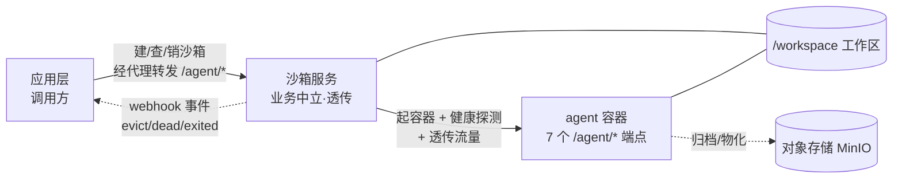

# 应用集成指南(新手版)

> 状态:Informative · 读者:第一次把应用/agent 接入本沙箱服务的新手开发者
> 权威契约:[`agent-contract.md`](../agent-contract.md) · [`sandbox-lifecycle.md`](../sandbox-lifecycle.md)(Normative)
> 参考实现:[`echo_agent/`](../../echo_agent/)(零业务最小合规 agent,可直接照抄)

## 0. 这份指南怎么用

- **谁该读**:想把**自己的 agent** 或**自己的应用**接入本沙箱服务、又第一次接触的人。
- **读完能干嘛**:不动平台一行代码,把一个合规 agent 跑起来,让应用层能建沙箱、跟 agent 对话、用完回收。
- **先决条件**:会用 Docker 基本命令;手上有一个 `SERVICE_TOKEN`(找运维要)。
- **怎么看**:从头到尾顺着读是一整条路;急着查接口直接跳 §7 契约速查表。

## 1. 它是什么

一句话:**给 agent 一个隔离的容器 + 一块工作区,把流量原样代理进去,其余一概不管。** 因为它不认识任何业务,任何遵守契约的 agent 都能直接跑。

系统分三层,各管各的:

| 层 | 是谁 | 管 | 不管 |
| --- | --- | --- | --- |
| 应用层(调用方) | 你的应用后台 | 建沙箱/销毁、经代理跟 agent 对话、消费事件、用完回收 | 不碰容器内部 |
| 沙箱服务 | 本服务 | 容器生命周期、通用代理(含 SSE 流式)、工作区快照、被动事件通知 | 不解析 agent 协议内容、不主动调你的后端 |
| agent 容器 | 你的 agent 镜像 | 跑业务、发事件、物化/归档工作区 | 不自行管容器生死 |

两条契约把边界钉死:
- **agent 契约**([`agent-contract.md`](../agent-contract.md)):容器内 agent 要实现的 7 个 `/agent/*` 端点。
- **沙箱生命周期契约**([`sandbox-lifecycle.md`](../sandbox-lifecycle.md)):应用层调沙箱服务的北向 API。



## 2. 先跑通参考实现(建立体感)

先不写自己的代码。仓库自带一个零业务的最小合规 agent `echo_agent`,用它跑一遍端到端冒烟,看到「建沙箱 -> 代理 -> SSE -> 工作区 -> 生命周期」全链路通,你就有体感了:

```bash
docker compose -f deploy/docker-compose.smoke.yml up -d --build
bash deploy/smoke.sh
docker compose -f deploy/docker-compose.smoke.yml down
```

`smoke.sh` 全绿 = 链路没问题。后面把你自己的 agent 换进来即可。

## 3. 做你的 agent

### 3.1 你要交付什么

一个**自带入口(CMD/ENTRYPOINT)的容器镜像**:容器内起一个 HTTP 服务,监听 `0.0.0.0:${AGENT_PORT}`(默认 8080),实现这 7 个端点(细节见 [`agent-contract.md`](../agent-contract.md) §2):

| 方法 | 路径 | 一句话行为 |
| --- | --- | --- |
| GET | `/agent/health` | 返回 `{ok, busy, run_id, contractVersion:"1.0"}` |
| POST | `/agent/input` | 收 RunRequest,**立即 202**,后台执行;活跃期重复 -> 409 |
| POST | `/agent/resume` | 续跑(同 input,宿主已把审批编进 resume_item) |
| POST | `/agent/cancel` | 幂等取消;事件流以 `RUN_CANCELLED` 收尾 |
| GET | `/agent/events` | SSE:`RUN_STARTED … 终止事件 -> __finalize__ -> 关流` |
| POST | `/agent/materialize` | 工作区物化,**幂等**(二次 `mode="skipped"`) |
| POST | `/agent/archive` | 归档到对象存储,返回 `payload_key` + 内容级 `changed` |

### 3.2 最短路径:抄 echo_agent

`echo_agent/app.py`(~150 行)是可运行的最小骨架:全 7 端点、正确的 SSE 帧序与 `__finalize__` 收尾、单容器单活跃 run、materialize 幂等。直接以它为模板,通常只改三处:

- `/agent/input` 后台 worker:把「echo 一句话」换成你真正的 run(调 LLM、跑工具、发事件);
- `/agent/materialize`:新会话按需播种、旧会话按 `payload_key` 从对象存储恢复(echo 直接 `skipped`);
- `/agent/archive`:把 `/workspace` 打包上传对象存储并返回 `payload_key`(echo 是 stub)。

### 3.3 运行环境(沙箱注入,agent 只读)

容器启动时沙箱服务注入 env,你的 agent 只读使用,分几类:

- **身份**:`SESSION_ID` / `OWNER_ID` / `PROJECT_ID` / `PAYLOAD_KEY`;
- **路径**:`WORKSPACE=/workspace`(唯一持久面)、`DEBUG_DIR=/tmp/debug`;
- **LLM**(经宿主 proxy,**永不给真实 key**):`LLM_BASE_URL`、`LLM_API_KEY`(= `AGENT_TOKEN`)、`LLM_MODEL`;
- **对象存储**(数据面直连):`MINIO_ENDPOINT` / `MINIO_ACCESS_KEY` / `MINIO_SECRET_KEY` / `MINIO_DEFAULT_BUCKET`。

要点:你的 agent**不自行持久化对话历史**(宿主经 `history` 装载、`__finalize__` 回收)。不需要 LLM/MinIO 的纯工具型 agent,忽略对应 env 即可。

### 3.4 构建镜像(关键:自带入口)

镜像必须**自启服务**(沙箱默认不注入启动命令)。参照 `echo_agent/Dockerfile`:

```dockerfile
FROM python:3.12-slim
WORKDIR /srv
COPY your_agent/requirements.txt /tmp/req.txt
RUN pip install --no-cache-dir -r /tmp/req.txt
COPY your_agent /srv/your_agent
ENV PYTHONPATH=/srv AGENT_PORT=8080 WORKSPACE=/workspace
EXPOSE 8080
CMD ["sh", "-c", "uvicorn your_agent.app:app --host 0.0.0.0 --port ${AGENT_PORT:-8080}"]
```

```bash
docker build -t your-agent:latest -f your_agent/Dockerfile .
```
