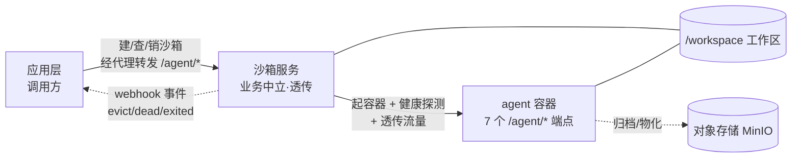

# 应用集成指南(新手版)

> 状态:Informative · 读者:第一次把应用/agent 接入本沙箱服务的新手开发者
> 权威契约:[`agent-contract.md`](../agent-contract.md) · [`sandbox-lifecycle.md`](../sandbox-lifecycle.md)(Normative)
> 参考实现:[`echo_agent/`](../../echo_agent/)(零业务最小合规 agent,可直接照抄)

## 0. 这份指南怎么用

- **谁该读**:想把**自己的 agent** 或**自己的应用**接入本沙箱服务、又第一次接触的人。
- **读完能干嘛**:不动平台一行代码,把一个合规 agent 跑起来,让应用层能建沙箱、跟 agent 对话、用完回收。
- **先决条件**:会用 Docker 基本命令;手上有一个 `SERVICE_TOKEN`(找运维要)。
- **怎么看**:从头到尾顺着读是一整条路;急着查接口直接跳 §7 契约速查表。

## 1. 它是什么

一句话:**给 agent 一个隔离的容器 + 一块工作区,把流量原样代理进去,其余一概不管。** 因为它不认识任何业务,任何遵守契约的 agent 都能直接跑。

系统分三层,各管各的:

| 层 | 是谁 | 管 | 不管 |
| --- | --- | --- | --- |
| 应用层(调用方) | 你的应用后台 | 建沙箱/销毁、经代理跟 agent 对话、消费事件、用完回收 | 不碰容器内部 |
| 沙箱服务 | 本服务 | 容器生命周期、通用代理(含 SSE 流式)、工作区快照、被动事件通知 | 不解析 agent 协议内容、不主动调你的后端 |
| agent 容器 | 你的 agent 镜像 | 跑业务、发事件、物化/归档工作区 | 不自行管容器生死 |

两条契约把边界钉死:
- **agent 契约**([`agent-contract.md`](../agent-contract.md)):容器内 agent 要实现的 7 个 `/agent/*` 端点。
- **沙箱生命周期契约**([`sandbox-lifecycle.md`](../sandbox-lifecycle.md)):应用层调沙箱服务的北向 API。

