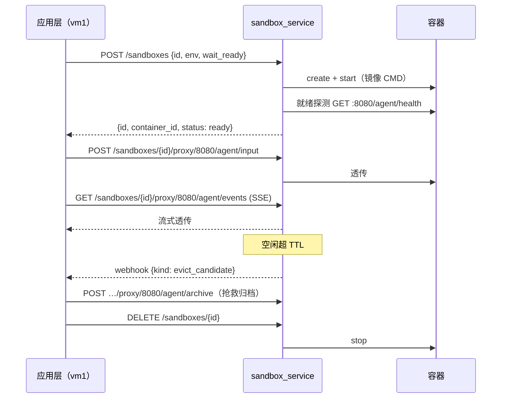

# 沙箱生命周期契约（Sandbox Lifecycle API）v1.0

> 状态：Normative（目标形态）+ 现状映射 · 读者：应用层开发者 / 平台工程
> 机器可校验 schema：`protocol/schemas/sandbox-lifecycle.schema.json`（JSON Schema 2020-12）
> 关联：`protocol/agent-contract.md`（容器内 agent 数据面契约）、`.cursor/plans/通用沙箱服务解耦计划`（落地计划）
>
> 设计基线借鉴 OpenSandbox：**协议优先、控制面业务中立、agent 协议经通用代理透传**。

---

## 0. 契约定位

本契约定义**综合沙箱服务（`sandbox_service/`，现 vm2 sandbox_manager 的继任者）北向 API**。调用方是任意「应用层」（本仓为 vm1 会话管理服务）。

边界铁律：

- 沙箱服务只认识：**镜像、容器、端口、资源限额、env（不透明 map）、工作区目录、不透明 payload_key**。
- 沙箱服务**不认识**：run / draft / version / enterprise / blob 等任何业务语义。
- 容器内跑什么协议（如 `agent-contract.md`）由应用层与容器约定，沙箱经**通用端点代理**透传、零感知。

### 0.1 版本

- 本契约版本 `1.0`。`GET /health` 返回 `apiVersion`。
- 兼容策略：v1 生命周期内旧 `/containers/*` / `/workspaces/*` 路由保留为 shim（见 §4 映射表）。

### 0.2 鉴权

除 `GET /health` 外所有端点要求 `Authorization: Bearer <SERVICE_TOKEN>`（单一共享服务 token，沿用 `VM2_SERVICE_TOKEN` 语义）。token 的签发与轮换归调用方运维管理，本服务只做等值校验。

---

## 1. 资源模型

```
Sandbox（沙箱）
 ├─ id            = 调用方给的稳定标识（本仓 = session_id；服务对其语义零感知）
 ├─ container_id  = 运行时容器 id（服务内部产物，north API 同时接受两者定位）
 ├─ spec          = 镜像/入口/端口/资源/env/挂载（创建时给定）
 ├─ state         = creating | running | idle | evict_candidate | dead | terminated
 └─ workspace     = 服务本地目录，bind mount 到容器 /workspace
```

- **keep-warm 池语义**：`POST /sandboxes` 对同一 `id` 幂等——已有活容器则直接复用返回；池满返回 503 `capacity_full`；空闲超 TTL 进入 `evict_candidate`（只标记，不自行销毁，由调用方决策，见 §2.6 webhook）。

## 2. 端点（目标形态）

### 2.1 服务级

| 方法 | 路径 | 语义 |
| --- | --- | --- |
| GET | `/health` | `{ok, apiVersion, image?}`（公开） |
| GET | `/capacity` | 池统计：`{live, leased, idle, capacity, idleTtl, evict_candidates[]}` |

### 2.1.1 镜像预热

跨机部署下镜像由 registry 分发，而 `docker create` **不会**自动拉——缺镜像直接失败。
发版方（应用层）推完新 tag 后打这里一次，沙箱机就把镜像提前拉好，无需人工登机器 `docker pull`，
也避免把几分钟的拉取压到第一个用户的建沙箱请求上。

服务仍然**被动**：它不知道谁在发版、不轮询任何仓库，只按请求拉指定镜像。

| 方法 | 路径 | 语义 |
| --- | --- | --- |
| POST | `/images` | `{image?}`（缺省 `AGENT_IMAGE`）→ **202** 立刻返回，后台拉取。幂等：已就位回 `present`，在拉则复用同一次，不会并发拉两遍 |
| GET | `/images?image=…` | `{image, state, startedAt, finishedAt, error}`，`state ∈ pulling｜present｜failed｜absent` |

`absent` = 本机没有且本进程没拉过；`present` 也可能来自人工 `build`/`load`，不代表拉过。

**必须异步**：拉几百 MB 要数分钟，调用方（如应用后端的启动钩子）不能被阻塞。
想彻底消掉「镜像还在拉时已有用户进来」的窗口，就在部署脚本里轮 `GET /images` 等到
`present` 再放流量。

建沙箱路径按 `AGENT_IMAGE_PULL_POLICY`（§3）兜底：缺镜像时同步拉，
且与预热共用同一把镜像锁——预热没跑完就来请求，会等它拉完而非重复拉，
代价是该请求可能耗时数分钟（调用方超时风险，故仍应先预热）。

### 2.2 沙箱生命周期

**`POST /sandboxes`** —— 创建（或幂等复用）沙箱：

```jsonc
{
  "id": "s-123",                    // 必填：调用方稳定标识
  "image": "tax-agent:agent-latest",// 可选：缺省用服务配置的 AGENT_IMAGE
  "env": { "SESSION_ID": "s-123", "AGENT_TOKEN": "…" },  // 不透明透传，服务不解析
  "port": 8080,                     // 容器内服务端口（健康检查/代理目标），缺省 8080
  "resource_limits": { "cpu": 2.0, "mem_mb": 2048 },      // 可选，缺省服务配置
  "egress_allow": ["10.0.0.2"],     // 可选出网白名单
  "wait_ready": { "path": "/agent/health", "timeout_s": 90 },  // 可选就绪探测（HTTP 200 即绪）
  "callback_url": "https://app/hooks/sandbox"  // 可选：本沙箱事件 sink（见 §2.6），服务视作不透明
}
```

响应 200：`{"id": "s-123", "container_id": "…", "status": "ready", "workspace": "/var/sandbox/workspaces/s-123"}`
错误：503 `capacity_full`、502 `image_pull_failed` / `container_create_failed` / `not_ready`。

> 对比现状 `/containers/start`：`enterprise_id`/`period`/`template`/`payload_key`/`token`/`owner_id` 等业务字段全部取消——应用层把它们编进 `env` map（`ENTERPRISE_ID=…` 等），服务不再感知。

| 方法 | 路径 | 语义 |
| --- | --- | --- |
| GET | `/sandboxes/{id}` | 状态：容器 inspect + 就绪探测结果 `{state, running, exit_code, started_at, probe?}` |
| DELETE | `/sandboxes/{id}` | 停容器（SIGTERM→grace→SIGKILL；`?grace_seconds=5`）；幂等 |

DELETE 的销毁结果**以容器运行时为准，不以服务内存账本为准**：摘掉租约后必须再按沙箱标签
扫一遍容器（账本会因进程被 SIGKILL、stop 半途失败等原因漂移），确认全部消失才回 200；
扫不干净一律 5xx 让调用方重试。返回 `{"ok": true, "terminated": bool}`，`terminated`
表示本次确实停掉了东西（幂等重复删为 `false`）。**回 200 却留着容器在跑是契约违规**——
调用方会认为已释放，容器就此成为无人认领的孤儿。

实现还须提供兜底：周期性扫描带本服务标签、却不在账本内的容器并回收；扫描要放行「刚创建、
尚未登记租约」的在途容器（本实现默认 `ORPHAN_MIN_AGE_SECONDS=120`），否则会误杀正在创建的沙箱。

### 2.3 通用端点代理

**`ANY /sandboxes/{id}/proxy/{port}/{path...}`** —— 把请求原样转发到容器 `{bridge_ip}:{port}/{path}`：

- 方法、query、请求体、响应体、状态码全透传；
- 响应为 `text/event-stream` 时按流式转发（SSE 不缓冲）；
- 容器不可达 → 502 `sandbox_unreachable`；沙箱不存在 → 404。

应用层经此调用容器内任意协议（本仓：`agent-contract.md` 的 `/agent/*`）。

### 2.4 工作区快照（业务中立）

| 方法 | 路径 | 语义 |
| --- | --- | --- |
| POST | `/sandboxes/{id}/workspace/ensure` | 建空工作区骨架（幂等；骨架目录由服务配置 `WORKSPACE_SKELETON_DIRS` 提供，服务不预设语义） |
| POST | `/sandboxes/{id}/workspace/snapshot/restore` | `{payload_key, scope?, blob_key_template?}`：从对象存储把快照重灌工作区（快照不存在 → 404 `payload_missing`；`scope.preserve[]` 顶层保留项，缺省 `["knowledge",".agent"]`） |
| POST | `/sandboxes/{id}/workspace/import` | multipart tar.gz 覆盖导入 |

快照格式约定（informative）：tar 内若带 `uploads-meta/upload-log.json`（`{rel: sha}`），且请求提供 `blob_key_template`（如 `users/u1/blobs/{sha2}/{sha}`，占位符 `{sha}`/`{sha2}`），服务逐条从对象存储拉回上传文件字节——**模板由调用方给定**，服务不解读其归属语义。

> 快照的**产生**（archive）在容器内数据面完成（agent 直连对象存储，见 `agent-contract.md` §2.7），沙箱服务只负责「按不透明 key 恢复」。对象存储经 `ObjectStore` 协议可插拔，默认 MinIO（读 `MINIO_*` env）。

### 2.5 工作区文件

| 方法 | 路径 | 语义 |
| --- | --- | --- |
| GET | `/sandboxes/{id}/workspace/files` | 文件树 |
| GET | `/sandboxes/{id}/workspace/files/{path}` | 读文件（utf-8 / base64） |
| PUT | `/sandboxes/{id}/workspace/files/{path}` | 写文本文件 |
| DELETE | `/sandboxes/{id}/workspace/files/{path}` | 删文件/目录 |
| POST | `/sandboxes/{id}/workspace/files` | multipart 上传（落 `uploads/`，重名去重） |

路径安全：规范化 + 前缀校验，禁 `..` 与符号链接逃逸（403 `path_escape`）。

### 2.6 事件通知（webhook）

沙箱服务是**被动组件**：唯一的出站是可选的通用事件 webhook，语义中立、不含任何业务回调。sink 地址来源二选一（后者优先）：

- **按沙箱自带**：调用方在 `POST /sandboxes` 传 `callback_url`，服务只把它当不透明 sink——这样服务**不持有任何全局应用地址**，每个调用方带自己的 sink。
- **部署级默认**：`CALLBACK_URL` env（+ `SERVICE_TOKEN` Bearer）。

二者皆空即不通知，调用方轮询 `/capacity` 与 `GET /sandboxes/{id}` 兜底。

> 注意：草稿归档编排、run 终态触发归档、归档结果入账等**业务推送**不在本服务职责内——它们属于应用层。应用层自行定时或在消费到终态事件后显式调用 `/agent/archive`（经代理/shim），并本地入账。

服务在下列时刻 POST 通知（尽力而为，失败重试 3 次后放弃）：

```jsonc
// POST {CALLBACK_URL}
{ "kind": "evict_candidate" | "dead" | "exited",
  "sandbox_id": "s-123",
  "container_id": "…",
  "reason": "idle_ttl" | "health_probe_failed" | "oom" | "exit",
  "ts": "2026-07-24T09:00:00Z" }
```

- `evict_candidate`：空闲超 TTL。服务**不自行销毁**；调用方收到后自行决策（如先经代理归档，再 `DELETE /sandboxes/{id}`）。
- `dead` / `exited`：健康探测连续失败 / 容器退出（含 OOM）。

## 3. 环境变量（服务自身配置）

| 变量 | 语义 |
| --- | --- |
| `SANDBOX_SERVICE_PORT` | 监听端口（缺省 8001） |
| `SERVICE_TOKEN` | 北向 Bearer token（兼容读 `VM2_SERVICE_TOKEN`） |
| `SANDBOX_WORKSPACE_ROOT` | 工作区根（宿主机同路径 bind 约束不变） |
| `AGENT_IMAGE` | 缺省镜像 |
| `AGENT_IMAGE_PULL_POLICY` | 起容器前拉取策略：`missing`（缺省，本地没有才拉）｜`always`（每次查 registry，配滚动 tag 用）｜`never`（完全不拉）。非法值回落 `missing` |
| `AGENT_COMMAND` | 缺省空 = 用镜像 CMD；`legacy` = 注入 uvicorn 命令（过渡一个版本） |
| `AGENT_PORT` / `AGENT_CPU` / `AGENT_MEM_MB` | 缺省端口/资源 |
| `AGENT_CODE_MOUNTS` | 热挂载列表 `host:container:ro[,…]`（泛化 `AGENT_CODE_DIR`） |
| `AGENT_NETWORK` / `AGENT_EGRESS_ALLOW` | 容器网络 / 出网白名单缺省 |
| `ORPHAN_SWEEP_SECONDS` | 孤儿容器巡检周期（缺省 60；`<=0` 关闭） |
| `ORPHAN_MIN_AGE_SECONDS` | 巡检放行的容器年龄（缺省 120），保护在途创建 |
| `POOL_CAPACITY` / `IDLE_TTL_SECONDS` / `REAP_INTERVAL_SECONDS` | 池治理 |
| `CALLBACK_URL` | §2.6 webhook 部署级默认 sink（空 = 不通知；可被按沙箱 `callback_url` 覆盖） |
| `ENABLE_LEGACY_SHIM` | 是否挂载本仓税务兼容层（`0` = 纯通用服务，缺省 `1`） |
| `MINIO_*` | ObjectStore 默认实现（MinIO/S3 兼容）凭据 |

**不再有** `POSTGRES_*`（沙箱服务零数据库依赖）、`VM1_INTERNAL_URL` / `LEGACY_VM1_URL`（业务回调链取消——服务不主动联系任何应用后端）、`ARCHIVE_INTERVAL_SECONDS`（归档编排归应用层）。

## 4. 现状 → 目标 路由映射（shim 对照表）

v1 生命周期内旧路由在新服务中保留为 shim（内部转调新实现，行为不变），供 vm1 灰度切换：

| 现状（sandbox_manager） | 目标（sandbox_service） | 备注 |
| --- | --- | --- |
| `POST /containers/start` | `POST /sandboxes` | shim 保留业务字段→env 的翻译（`ENTERPRISE_ID` 等注入） |
| `POST /containers/{cid}/input` | `POST /sandboxes/{id}/proxy/8080/agent/input` | shim 内部走代理 |
| `POST /containers/{cid}/resume` | `POST /sandboxes/{id}/proxy/8080/agent/resume` | 同上 |
| `POST /containers/{cid}/cancel` | `POST /sandboxes/{id}/proxy/8080/agent/cancel` | 同上 |
| `GET /containers/{cid}/events` | `GET /sandboxes/{id}/proxy/8080/agent/events` | SSE 透传 |
| `POST /containers/{cid}/archive` | `POST /sandboxes/{id}/proxy/8080/agent/archive` | shim 保留 lease 字段补全（owner/project） |
| `POST /containers/{cid}/terminate` | `DELETE /sandboxes/{id}` | |
| `GET /containers/{cid}/health` | `GET /sandboxes/{id}` | |
| `GET /capacity` | `GET /capacity` | 不变 |
| `POST /workspaces/{sid}/ensure` | `POST /sandboxes/{id}/workspace/ensure` | |
| `POST /workspaces/{sid}/import` | `POST /sandboxes/{id}/workspace/import` | |
| `POST /workspaces/{sid}/restore` | `POST /sandboxes/{id}/workspace/snapshot/restore` | 请求体 `owner_id` 字段在新路由取消（key 已含归属） |
| `GET/PUT/DELETE/POST /workspaces/{sid}/files…` | `…/sandboxes/{id}/workspace/files…` | 同形 |
| `DELETE /blobs/{sha}` | **取消**（应用层直连对象存储） | shim 保留至 vm1 切换完成 |

shim 是**纯被动**层（请求→翻译→转发→响应），不主动回调应用后端。以下旧 vm2 的**主动推送**行为一律不进 shim，改由应用层承担：

- **归档定时器**（旧 `archive/scheduler.py`）与 **vm1 回调**（`POST /internal/archive-result`）：归档编排移到应用层（vm1 定时器经代理/shim 调 `/agent/archive`、结果本地入账——vm1 本就是调用方，同步拿到结果，无需服务反向回传）。
- **run 终态触发归档**（旧 `EventUplink.on_terminal`）：shim 的 `/containers/{cid}/events` 现为纯中继；由应用层在消费到终态事件时自行触发 `/containers/{cid}/archive`。
- **容器退出上报**（旧 `POST /internal/container-exited`）：改由通用 webhook（§2.6，`exited`/`dead`）承载，应用层消费或轮询兜底。

## 5. 生命周期时序（目标形态）



## 6. 合规性（Conformance）

lifecycle conformance suite（`tests/lifecycle_conformance/`，黑盒）验证任意实现（含未来 OpenSandbox 适配层）：

1. `POST /sandboxes` 就绪返回；同 `id` 二次创建幂等复用；池满 503；
2. 代理透传：普通 HTTP 与 SSE 流均不失真、容器不可达 502；
3. 工作区快照 restore：不存在的 key → 404 且**不破坏现有工作区**；
4. 文件 API 路径逃逸一律 403；
5. `DELETE` 幂等；`GET /sandboxes/{id}` 状态与容器实际一致；
6. webhook：TTL 逐出候选 / 容器死亡按约投递（或降级轮询可见）。
