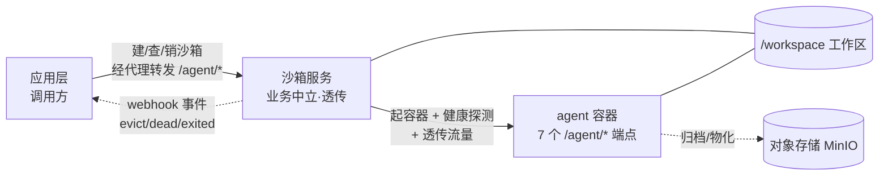
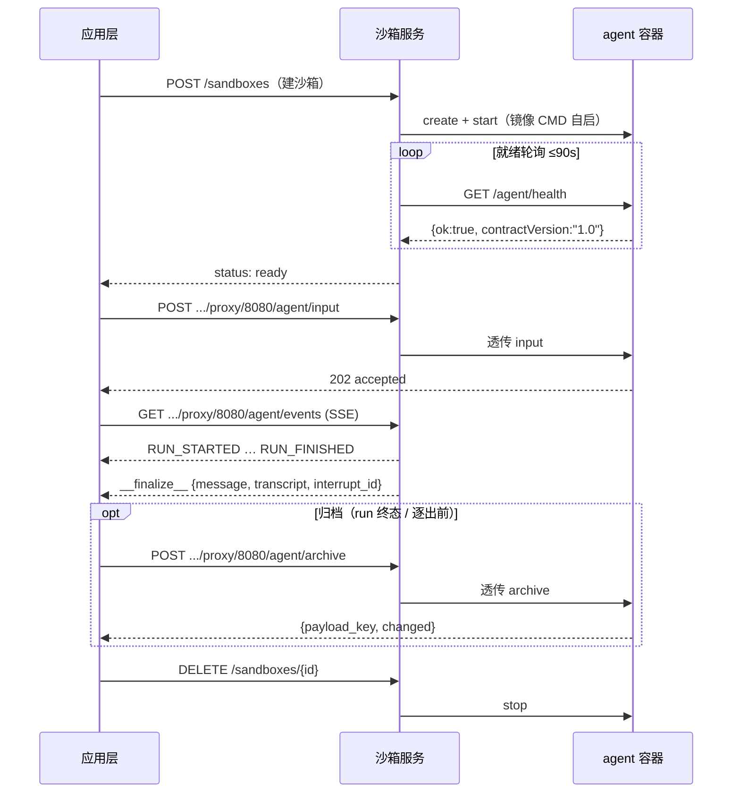
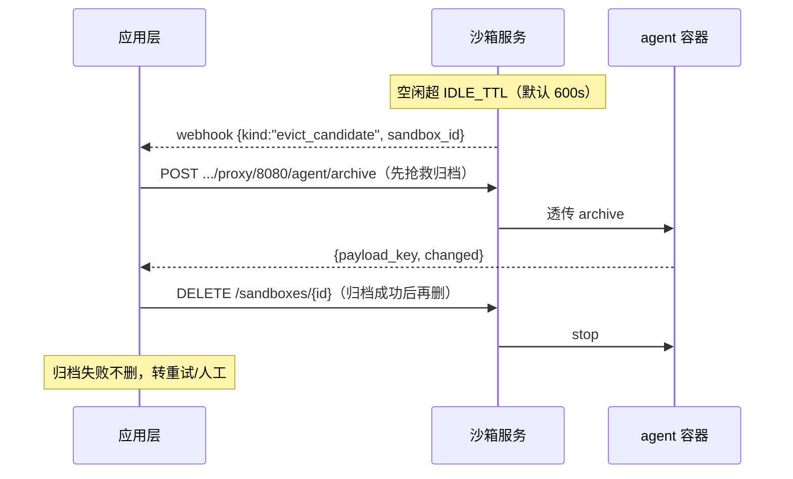

# 应用集成指南 Implementation Plan

> **For agentic workers:** REQUIRED SUB-SKILL: Use superpowers:subagent-driven-development (recommended) or superpowers:executing-plans to implement this plan task-by-task. Steps use checkbox (`- [ ]`) syntax for tracking.

**Goal:** 为 sandbox-service 写两份新手友好的应用集成指南(方案 A 主线 + 方案 B 重排版),覆盖全链路接入。

**Architecture:** 两份 markdown 文档,以 `docs/agent-contract.md` / `docs/sandbox-lifecycle.md` 为权威内容来源。方案 A(`beginner-integration-guide.md`)线性旅程先出;方案 B(`integration-guide-by-role.md`)复用 A 的内容按角色重排。含 3 张 mermaid 图 + 1 份 AI 友好契约速查表。

**Tech Stack:** Markdown · Mermaid(架构图 `graph LR` + 序列图 `sequenceDiagram`)

## Global Constraints

- **权威来源**:事实性内容(端点/状态码/env/合规项)以 `docs/agent-contract.md` v1.0 与 `docs/sandbox-lifecycle.md` v1.0 为准;速查表每行须能对回这两份 normative 文档,不得臆造。
- **3 张 mermaid 图**:架构图、run 生命周期序列图、回收序列图;内容逐字使用 spec §7(见各任务内联),不得改动语义。
- **速查表 4 张表 + AI 指令**:逐字使用 spec §8,复制到指南 §7 / B 的 Part3。
- **通俗表达**:新手可懂;术语首次出现即解释;`echo_agent` 贯穿做运行示例;中文。
- **范围外不写**:换沙箱底座、税务 `[tax]` 扩展字段细节、legacy shim 路由映射表、归档内容格式/blob 去重实现、生产运维(MinIO 集群/token 轮换)。
- **交叉引用**:指南内链接到 `../agent-contract.md`、`../sandbox-lifecycle.md`、`../agent-onboarding.md`、`../../echo_agent/`;不替换 `agent-onboarding.md`,形成「入门 -> 进阶」梯度。
- **提交策略**:按用户偏好,commit 仅在用户授权时执行。每个任务末尾的 commit 步骤在用户授权后进行;若用户要求统一提交,则累积到末尾一次提交。当前在 `main` 分支,首次提交前先开分支 `docs/integration-guide`。
- **Spec 出处**:本计划的内容要点与图表来源为 `docs/superpowers/specs/2026-07-29-integration-guide-design.md`。

---

## File Structure

| 文件 | 责任 | 创建/修改 |
| --- | --- | --- |
| `docs/integration/beginner-integration-guide.md` | 方案 A:线性旅程,§0–§7,新手从头跟到上线 | 创建 |
| `docs/integration/integration-guide-by-role.md` | 方案 B:按角色切分,Part1-3 + 附录,复用 A 的内容 | 创建 |
| `README.md` | 「接入一个新 agent」段加一行指向方案 A 入门指南 | 修改(仅加 1 行链接) |
| `docs/agent-onboarding.md` | 顶部读者提示加一行指向方案 A 入门指南 | 修改(仅加 1 行链接) |

---

### Task 1: 脚手架 + §0 怎么用 + §1 它是什么(架构图)

**Files:**
- Create: `docs/integration/beginner-integration-guide.md`

**Interfaces:**
- Consumes: spec §5(§0/§1 要点)、spec §7.1(架构图 mermaid)、`README.md:1-14`(系统定位)
- Produces: 指南标题块、§0、§1(含架构图)。后续任务在其后追加。

- [ ] **Step 1: 建分支**

```bash
git checkout -b docs/integration-guide
```

- [ ] **Step 2: 创建文件,写标题块 + §0**

写文件 `docs/integration/beginner-integration-guide.md`,内容:

```markdown
# 应用集成指南(新手版)

> 状态:Informative · 读者:第一次把应用/agent 接入本沙箱服务的新手开发者
> 权威契约:[`agent-contract.md`](../agent-contract.md) · [`sandbox-lifecycle.md`](../sandbox-lifecycle.md)(Normative)
> 参考实现:[`echo_agent/`](../../echo_agent/)(零业务最小合规 agent,可直接照抄)

## 0. 这份指南怎么用

- **谁该读**:想把**自己的 agent** 或**自己的应用**接入本沙箱服务、又第一次接触的人。
- **读完能干嘛**:不动平台一行代码,把一个合规 agent 跑起来,让应用层能建沙箱、跟 agent 对话、用完回收。
- **先决条件**:会用 Docker 基本命令;手上有一个 `SERVICE_TOKEN`(找运维要)。
- **怎么看**:从头到尾顺着读是一整条路;急着查接口直接跳 §7 契约速查表。
```

- [ ] **Step 3: 写 §1 它是什么(含架构图)**

追加:

````markdown
## 1. 它是什么

一句话:**给 agent 一个隔离的容器 + 一块工作区,把流量原样代理进去,其余一概不管。** 因为它不认识任何业务,任何遵守契约的 agent 都能直接跑。

系统分三层,各管各的:

| 层 | 是谁 | 管 | 不管 |
| --- | --- | --- | --- |
| 应用层(调用方) | 你的应用后台 | 建沙箱/销毁、经代理跟 agent 对话、消费事件、用完回收 | 不碰容器内部 |
| 沙箱服务 | 本服务 | 容器生命周期、通用代理(含 SSE 流式)、工作区快照、被动事件通知 | 不解析 agent 协议内容、不主动调你的后端 |
| agent 容器 | 你的 agent 镜像 | 跑业务、发事件、物化/归档工作区 | 不自行管容器生死 |

两条契约把边界钉死:
- **agent 契约**([`agent-contract.md`](../agent-contract.md)):容器内 agent 要实现的 7 个 `/agent/*` 端点。
- **沙箱生命周期契约**([`sandbox-lifecycle.md`](../sandbox-lifecycle.md)):应用层调沙箱服务的北向 API。


````

- [ ] **Step 4: 校验架构图语法**

对照 `docs/agent-contract.md:198-231` 已能正常渲染的 `sequenceDiagram`,确认本图 `graph LR` 语法合法:`节点[文本]`、`-->|标签|`、`-.标签.->`、`---` 均符合 mermaid 规范;`<br/>` 换行合法。可选:VSCode Mermaid 预览确认渲染。
Expected: 三层 + 工作区 + 对象存储 + webhook 五条关系均画出。

- [ ] **Step 5: 提交(待用户授权)**

```bash
git add docs/integration/beginner-integration-guide.md
git commit -m "docs(integration): 新增新手集成指南 §0-§1 脚手架与架构图"
```

---

### Task 2: §2 先跑通参考实现 + §3.1-3.4 做你的 agent

**Files:**
- Modify: `docs/integration/beginner-integration-guide.md`(追加 §2、§3.1-3.4)

**Interfaces:**
- Consumes: spec §5(§2/§3.1-3.4 要点)、`README.md:35-41`(冒烟命令)、`docs/agent-onboarding.md:29-79`(抄 echo / 改 3 处 / Dockerfile)、`docs/agent-contract.md:52-61`(7 端点表)、`docs/agent-contract.md:234-252`(env)
- Produces: §2、§3.1(7 端点小表)、§3.2(改 3 处)、§3.3(env 分类)、§3.4(Dockerfile 样板)。

- [ ] **Step 1: 写 §2 先跑通参考实现**

追加:

```markdown
## 2. 先跑通参考实现(建立体感)

先不写自己的代码。仓库自带一个零业务的最小合规 agent `echo_agent`,用它跑一遍端到端冒烟,看到「建沙箱 -> 代理 -> SSE -> 工作区 -> 生命周期」全链路通,你就有体感了:

\`\`\`bash
docker compose -f deploy/docker-compose.smoke.yml up -d --build
bash deploy/smoke.sh
docker compose -f deploy/docker-compose.smoke.yml down
\`\`\`

`smoke.sh` 全绿 = 链路没问题。后面把你自己的 agent 换进来即可。
```

(注意:代码块里的三反引号在正文中是真实反引号,不是转义。)

- [ ] **Step 2: 写 §3.1 交付物(7 端点小表)**

追加 §3 标题与 §3.1。7 端点事实逐行对照 `docs/agent-contract.md:52-61`:

```markdown
## 3. 做你的 agent

### 3.1 你要交付什么

一个**自带入口(CMD/ENTRYPOINT)的容器镜像**:容器内起一个 HTTP 服务,监听 `0.0.0.0:${AGENT_PORT}`(默认 8080),实现这 7 个端点(细节见 [`agent-contract.md`](../agent-contract.md) §2):

| 方法 | 路径 | 一句话行为 |
| --- | --- | --- |
| GET | `/agent/health` | 返回 `{ok, busy, run_id, contractVersion:"1.0"}` |
| POST | `/agent/input` | 收 RunRequest,**立即 202**,后台执行;活跃期重复 -> 409 |
| POST | `/agent/resume` | 续跑(同 input,宿主已把审批编进 resume_item) |
| POST | `/agent/cancel` | 幂等取消;事件流以 `RUN_CANCELLED` 收尾 |
| GET | `/agent/events` | SSE:`RUN_STARTED … 终止事件 -> __finalize__ -> 关流` |
| POST | `/agent/materialize` | 工作区物化,**幂等**(二次 `mode="skipped"`) |
| POST | `/agent/archive` | 归档到对象存储,返回 `payload_key` + 内容级 `changed` |
```

- [ ] **Step 3: 写 §3.2 抄 echo_agent(改 3 处)**

对照 `docs/agent-onboarding.md:29-44`:

```markdown
### 3.2 最短路径:抄 echo_agent

`echo_agent/app.py`(~150 行)是可运行的最小骨架:全 7 端点、正确的 SSE 帧序与 `__finalize__` 收尾、单容器单活跃 run、materialize 幂等。直接以它为模板,通常只改三处:

- `/agent/input` 后台 worker:把「echo 一句话」换成你真正的 run(调 LLM、跑工具、发事件);
- `/agent/materialize`:新会话按需播种、旧会话按 `payload_key` 从对象存储恢复(echo 直接 `skipped`);
- `/agent/archive`:把 `/workspace` 打包上传对象存储并返回 `payload_key`(echo 是 stub)。
```

- [ ] **Step 4: 写 §3.3 运行环境(env 注入)**

对照 `docs/agent-contract.md:234-252`:

```markdown
### 3.3 运行环境(沙箱注入,agent 只读)

容器启动时沙箱服务注入 env,你的 agent 只读使用,分几类:

- **身份**:`SESSION_ID` / `OWNER_ID` / `PROJECT_ID` / `PAYLOAD_KEY`;
- **路径**:`WORKSPACE=/workspace`(唯一持久面)、`DEBUG_DIR=/tmp/debug`;
- **LLM**(经宿主 proxy,**永不给真实 key**):`LLM_BASE_URL`、`LLM_API_KEY`(= `AGENT_TOKEN`)、`LLM_MODEL`;
- **对象存储**(数据面直连):`MINIO_ENDPOINT` / `MINIO_ACCESS_KEY` / `MINIO_SECRET_KEY` / `MINIO_DEFAULT_BUCKET`。

要点:你的 agent**不自行持久化对话历史**(宿主经 `history` 装载、`__finalize__` 回收)。不需要 LLM/MinIO 的纯工具型 agent,忽略对应 env 即可。
```

- [ ] **Step 5: 写 §3.4 构建镜像(Dockerfile 样板)**

对照 `docs/agent-onboarding.md:62-79`:

````markdown
### 3.4 构建镜像(关键:自带入口)

镜像必须**自启服务**(沙箱默认不注入启动命令)。参照 `echo_agent/Dockerfile`:

```dockerfile
FROM python:3.12-slim
WORKDIR /srv
COPY your_agent/requirements.txt /tmp/req.txt
RUN pip install --no-cache-dir -r /tmp/req.txt
COPY your_agent /srv/your_agent
ENV PYTHONPATH=/srv AGENT_PORT=8080 WORKSPACE=/workspace
EXPOSE 8080
CMD ["sh", "-c", "uvicorn your_agent.app:app --host 0.0.0.0 --port ${AGENT_PORT:-8080}"]
```

```bash
docker build -t your-agent:latest -f your_agent/Dockerfile .
```
````

- [ ] **Step 6: 校验事实一致性**

逐项对照:`docs/agent-contract.md:52-61`(7 端点方法/路径)、`:234-252`(env 变量名)、`docs/agent-onboarding.md:62-79`(Dockerfile CMD 写法)。确认无臆造字段。
Expected: 7 端点表 7 行与 normative 一致;env 变量名拼写一致;Dockerfile 含 `CMD` 且 `AGENT_COMMAND` 留空语义正确。

- [ ] **Step 7: 提交(待用户授权)**

```bash
git add docs/integration/beginner-integration-guide.md
git commit -m "docs(integration): 指南 §2 冒烟 + §3.1-3.4 做 agent"
```

---

### Task 3: §3.5 run 生命周期序列图 + §3.6 过 conformance

**Files:**
- Modify: `docs/integration/beginner-integration-guide.md`(追加 §3.5、§3.6)

**Interfaces:**
- Consumes: spec §7.2(run 生命周期 mermaid)、`docs/agent-contract.md:198-231`(权威时序)、`docs/agent-onboarding.md:83-98`(conformance 命令)
- Produces: §3.5(序列图)、§3.6(conformance 验证步骤)。

- [ ] **Step 1: 写 §3.5 run 生命周期序列图**

追加。mermaid 逐字用 spec §7.2:

````markdown
### 3.5 一个 run 的生命周期

从建沙箱到销毁,一次完整对话长这样(细节见 [`agent-contract.md`](../agent-contract.md) §3):



关键:agent 收 input **立即 202**,活儿在后台跑,产物经 `/agent/events` SSE 流出;流末尾必有 `__finalize__` 信封(宿主据此落库);活跃期重复 input 返回 409。
````

- [ ] **Step 2: 写 §3.6 过 conformance**

对照 `docs/agent-onboarding.md:83-98`:

```markdown
### 3.6 验证合规(黑盒,换靶子即可)

平台提供黑盒 conformance,**直接打你的 agent**,无需信任你的内部实现:

\`\`\`bash
# 起你的容器后,指向它跑 agent 契约套件
docker run -d --name my-agent -p 8080:8080 your-agent:latest
AGENT_BASE_URL=http://localhost:8080 python -m pytest tests/agent_conformance -q
\`\`\`

全绿即「合规 agent」。合规最小标准见 [`agent-contract.md`](../agent-contract.md) §6:health 90s 就绪且契约版本 major=1、input 202/409、SSE 收尾、cancel 幂等、materialize 幂等、archive 可恢复 + 查重、忽略未知字段。
```

- [ ] **Step 3: 校验序列图语法与帧序**

对照 `docs/agent-contract.md:198-231` 已能渲染的 `sequenceDiagram`:确认 `participant`/`loop`/`opt`/`->>`/`-->>` 语法合法;帧序为 `RUN_STARTED … RUN_FINISHED -> __finalize__ -> 关流`,与 `docs/agent-contract.md:135` 一致。
Expected: 序列图可渲染;帧序含 `__finalize__` 收尾;90s 就绪轮询、202、archive、DELETE 均在图中。

- [ ] **Step 4: 提交(待用户授权)**

```bash
git add docs/integration/beginner-integration-guide.md
git commit -m "docs(integration): 指南 §3.5 run 生命周期序列图 + §3.6 conformance"
```

---

### Task 4: §4 应用层接线(含回收序列图)

**Files:**
- Modify: `docs/integration/beginner-integration-guide.md`(追加 §4)

**Interfaces:**
- Consumes: spec §5(§4 要点)、spec §7.3(回收序列图 mermaid)、`docs/sandbox-lifecycle.md:77-111`(建沙箱/DELETE)、`:113-121`(代理)、`:147-170`(webhook)、`docs/app-recycle-integration-plan.md:25-40`(三层防线)
- Produces: §4.1-4.5(鉴权/建沙箱/代理对话/三层防线/回收序列图)。

- [ ] **Step 1: 写 §4.1 鉴权基址 + §4.2 建沙箱**

对照 `docs/sandbox-lifecycle.md:26-28`(鉴权)、`:77-95`(POST /sandboxes):

```markdown
## 4. 应用层接线

### 4.1 鉴权与基址

- 基址:`http://<sandbox-service-host>:8001`。
- 鉴权:除 `GET /health` 外所有端点带 `Authorization: Bearer <SERVICE_TOKEN>`。

### 4.2 建沙箱

`POST /sandboxes`,关键字段:`id`(你的稳定标识,本仓场景=会话 id)、`env`(不透明透传,服务不解析)、`callback_url`(本沙箱事件回调,可选)。对同一 `id` 幂等--已有活容器直接复用。

\`\`\`bash
curl -X POST http://localhost:8001/sandboxes \
  -H "Authorization: Bearer $SERVICE_TOKEN" \
  -d '{"id":"s-123","env":{"SESSION_ID":"s-123","AGENT_TOKEN":"…"},"callback_url":"https://app/hooks/sandbox"}'
\`\`\`
```

- [ ] **Step 2: 写 §4.3 经代理对话**

对照 `docs/sandbox-lifecycle.md:113-121`(代理透传含 SSE):

```markdown
### 4.3 跟 agent 说话(经通用代理)

应用层不直连容器,而是经沙箱服务的通用代理转发到容器内 `/agent/*`:

- 提交 run:`POST /sandboxes/{id}/proxy/8080/agent/input`
- 收事件流:`GET /sandboxes/{id}/proxy/8080/agent/events`(SSE 透传,不缓冲)

方法、请求体、响应、状态码全透传;容器不可达返回 502。agent 协议内容沙箱服务零感知。
```

- [ ] **Step 3: 写 §4.4 回收三层防线**

对照 `docs/app-recycle-integration-plan.md:25-40`(三层防线表):

```markdown
### 4.4 用完回收(三层防线)

沙箱不会自己关容器,关不关最终由应用层是否调 `DELETE /sandboxes/{id}` 决定。三层防线:

| 防线 | 谁触发 | 干什么 | 你要做的 |
| --- | --- | --- | --- |
| L1 退出即销毁 | 应用层(业务事件) | 用户退出工作空间时主动 DELETE | **主路径,必须接** |
| L2 空闲兜底 | 沙箱通知 + 应用层消费 | 空闲超 TTL 发 `evict_candidate` webhook,你收到后**先归档再 DELETE** | 配 callback_url + 收 webhook + 轮询 `/capacity` 兜底 |
| L3 孤儿巡检 | 沙箱服务自管 | 回收账本外的残留容器 | 不用管 |

要点:L2 的 webhook 是**尽力而为**(可能丢),所以必须同时轮询 `GET /capacity` 兜底;`evict_candidate` 后**先经代理归档、成功再 DELETE**,归档失败不删,避免丢数据。
```

- [ ] **Step 4: 写 §4.5 回收序列图**

mermaid 逐字用 spec §7.3:

````markdown
### 4.5 回收时序


````

- [ ] **Step 5: 校验回收序列图与事实**

对照 `docs/sandbox-lifecycle.md:223-244`(lifecycle 时序)与 `docs/app-recycle-integration-plan.md:147-151`(先归档后删):确认序列图语法合法;顺序为 `evict_candidate -> archive -> DELETE`;含「归档失败不删」标注。
Expected: 序列图可渲染;L2「先归档后删」语义与 normative 一致。

- [ ] **Step 6: 提交(待用户授权)**

```bash
git add docs/integration/beginner-integration-guide.md
git commit -m "docs(integration): 指南 §4 应用层接线与回收序列图"
```

---

### Task 5: §5 上线 + §6 验收清单

**Files:**
- Modify: `docs/integration/beginner-integration-guide.md`(追加 §5、§6)

**Interfaces:**
- Consumes: spec §5(§5/§6 要点)、`docs/agent-onboarding.md:102-120`(只改 .env / 版本协商)、`docs/agent-onboarding.md:124-134`(检查清单)、`docs/agent-contract.md:22-27`(版本协商)
- Produces: §5(上线)、§6(验收清单)。

- [ ] **Step 1: 写 §5 上线**

对照 `docs/agent-onboarding.md:102-120` 与 `docs/agent-contract.md:22-27`:

```markdown
## 5. 上线(只改 .env)

平台代码零改动,切换只动部署变量。改 `deploy/.env`:

\`\`\`dotenv
AGENT_IMAGE=your-agent:latest
AGENT_COMMAND=          # 留空 = 用镜像 CMD
AGENT_PORT=8080
\`\`\`

重启 `sandbox_service` 即生效。

> 版本协商:`/agent/health` 的 `contractVersion` major 必须 = 1,否则宿主判 `agent_contract_mismatch` 拒绝接入(见 [`agent-contract.md`](../agent-contract.md) §0.1)。
```

- [ ] **Step 2: 写 §6 验收清单**

对照 `docs/agent-onboarding.md:124-134`:

```markdown
## 6. 接入验收清单

- [ ] 镜像自带 CMD,起容器 90s 内 `/agent/health` `ok=true` 且 `contractVersion` major=1
- [ ] `/agent/input` 202;活跃期重复 409
- [ ] `/agent/events` 帧序合法,终止事件 + `__finalize__` 收尾、正常关流
- [ ] `/agent/cancel` 幂等,取消后 `RUN_CANCELLED`
- [ ] `/agent/materialize` 幂等(二次 `skipped`)
- [ ] `/agent/archive` 返回 `payload_key`,以该 key 重物化可恢复;无变化 `changed=false`
- [ ] 忽略未知扩展字段不报错
- [ ] `tests/agent_conformance`(打你的镜像)全绿 + `smoke.sh` 全绿
- [ ] 只改 `AGENT_IMAGE` 即接入,平台代码零改动
```

- [ ] **Step 3: 校验清单与 normative 一致**

对照 `docs/agent-onboarding.md:124-134`:确认 9 条逐条对齐,无遗漏无臆造;`contractVersion major=1` 与 `docs/agent-contract.md:25-27` 一致。
Expected: 清单 9 条与 onboarding §7 一致。

- [ ] **Step 4: 提交(待用户授权)**

```bash
git add docs/integration/beginner-integration-guide.md
git commit -m "docs(integration): 指南 §5 上线 + §6 验收清单"
```

---

### Task 6: §7 契约速查表(AI 友好)

**Files:**
- Modify: `docs/integration/beginner-integration-guide.md`(追加 §7)

**Interfaces:**
- Consumes: spec §8(4 张表 + AI 指令,逐字)、`docs/agent-contract.md:52-192`(端点/状态码)、`docs/sandbox-lifecycle.md:47-133`(lifecycle 端点)、`docs/agent-contract.md:234-252` 与 `docs/sandbox-lifecycle.md:172-192`(env)、`docs/agent-contract.md:260-270` 与 `docs/sandbox-lifecycle.md:246-255`(合规项)
- Produces: §7(AI 指令 + 表1 agent 端点 + 表2 lifecycle 端点 + 表3 env + 表4 合规项)。

- [ ] **Step 1: 写 §7 标题 + AI 指令 + 表1 agent 端点**

追加。AI 指令与表1 逐字用 spec §8,表1 事实对照 `docs/agent-contract.md:52-61`(方法/路径/成功码)与各端点小节(错误码:input/resume `:56`、materialize `:60`、archive `:61`):

````markdown
## 7. 契约速查表(AI 友好)

> **给 coding agent**:实现/对接以本表为最小契约;与 normative 文档冲突时,以 [`agent-contract.md`](../agent-contract.md) / [`sandbox-lifecycle.md`](../sandbox-lifecycle.md) 为准。机器可校验 schema 见 `docs/schemas/`,样例见 `docs/fixtures/`。

**表 1 · agent-contract 7 端点**

| 方法 | 路径 | 成功 | 错误 | 行为 |
| --- | --- | --- | --- | --- |
| GET | `/agent/health` | 200 | - | `{ok, busy, run_id, contractVersion:"1.0"}` |
| POST | `/agent/input` | 202 | 409 `run_busy`、502 `materialize_failed` | 收 RunRequest,立即 202,后台执行 |
| POST | `/agent/resume` | 202 | 同上 | 续跑(同形,宿主已编入 resume_item) |
| POST | `/agent/cancel` | 200 | - | 幂等;命中后事件流以 `RUN_CANCELLED` 收尾 |
| GET | `/agent/events` | 200 | - | SSE:`RUN_STARTED…终止事件->__finalize__->关流` |
| POST | `/agent/materialize` | 200 | 400、502 | 工作区物化,幂等(二次 `mode="skipped"`) |
| POST | `/agent/archive` | 200 | 400、502 | 归档到对象存储,返回 `payload_key` + 内容级 `changed` |
````

- [ ] **Step 2: 写表2 lifecycle 端点 + 表3 env**

逐字用 spec §8。表2 对照 `docs/sandbox-lifecycle.md:47-133`,表3 对照 `docs/agent-contract.md:234-252`:

```markdown
**表 2 · sandbox-lifecycle 关键端点**(除 `GET /health` 外均需 `Authorization: Bearer <SERVICE_TOKEN>`)

| 方法 | 路径 | 行为 |
| --- | --- | --- |
| GET | `/health` | `{ok, apiVersion}`(公开) |
| GET | `/capacity` | 池统计 `{live, leased, idle, capacity, idleTtl, evict_candidates[]}` |
| POST | `/images` | 镜像预热(异步 202,幂等) |
| POST | `/sandboxes` | 创建/幂等复用;body 含 `id`/`env`/`callback_url?`/`wait_ready?` |
| GET | `/sandboxes/{id}` | 状态 `{state, running, exit_code, probe?}` |
| DELETE | `/sandboxes/{id}` | 停容器(幂等);`{ok, terminated}` |
| ANY | `/sandboxes/{id}/proxy/{port}/{path...}` | 通用透传(含 SSE);容器不可达 502 |
| POST | `/sandboxes/{id}/workspace/snapshot/restore` | 按 `payload_key` 恢复工作区;不存在 404 |

**表 3 · 关键注入 env**(沙箱启动注入,agent 只读)

| 变量 | 语义 |
| --- | --- |
| `AGENT_PORT` | HTTP 监听端口(缺省 8080) |
| `WORKSPACE` | 工作区路径(`/workspace`,唯一持久面) |
| `SESSION_ID` / `OWNER_ID` | 会话/归属身份 |
| `PAYLOAD_KEY` | 非空->物化走快照恢复 |
| `AGENT_TOKEN` | 会话级 token(= `LLM_API_KEY`,回调宿主 Bearer) |
| `LLM_BASE_URL` / `LLM_API_KEY` / `LLM_MODEL` | LLM proxy(永不注入真实 key) |
| `MINIO_*` | 对象存储凭据(materialize/archive 数据面直连) |
```

- [ ] **Step 3: 写表4 合规检查项**

逐字用 spec §8。对照 `docs/agent-contract.md:260-270`(agent 7 条)与 `docs/sandbox-lifecycle.md:246-255`(lifecycle 6 条):

```markdown
**表 4 · 合规检查项**(conformance 黑盒)

- agent 侧(`tests/agent_conformance`):①镜像自带入口 90s 内 health `ok=true` 且 `contractVersion` major=1;②input 202 / 活跃期重复 409;③events 合法帧序 + `__finalize__` 收尾 + 正常关流;④cancel 幂等 -> `RUN_CANCELLED`;⑤materialize 幂等;⑥archive 返回 `payload_key` 且可恢复 + 无变化 `changed=false`;⑦忽略未知扩展字段不报错。
- lifecycle 侧(`tests/lifecycle_conformance`):①建沙箱就绪 + 同 id 幂等复用 + 池满 503;②代理透传普通 HTTP 与 SSE 不失真、不可达 502;③快照 restore 不存在 key -> 404 且不破坏现有工作区;④文件 API 路径逃逸 403;⑤DELETE 幂等 + 状态与容器一致;⑥webhook 按约投递或轮询可见。
```

- [ ] **Step 4: 校验速查表事实一致性**

逐表对照 normative:表1 7 行对 `docs/agent-contract.md:52-61`;表2 对 `docs/sandbox-lifecycle.md:47-133`;表3 变量名对 `docs/agent-contract.md:234-252`;表4 对 `docs/agent-contract.md:260-270` + `docs/sandbox-lifecycle.md:246-255`。任何不一致即改指南、不改 normative。
Expected: 4 张表所有方法/路径/状态码/变量名与 normative 逐字一致;AI 指令在表前。

- [ ] **Step 5: 提交(待用户授权)**

```bash
git add docs/integration/beginner-integration-guide.md
git commit -m "docs(integration): 指南 §7 契约速查表(AI 友好)"
```

---

### Task 7: 方案 A 整体校验

**Files:**
- Read-only 校验: `docs/integration/beginner-integration-guide.md`

**Interfaces:**
- Consumes: spec §5/§7/§10(覆盖与验收)、`docs/agent-contract.md`、`docs/sandbox-lifecycle.md`
- Produces: 校验通过后的方案 A 终稿(必要时就地修正)。

- [ ] **Step 1: 渲染校验 3 张 mermaid 图**

通读全文,确认 3 个 ```mermaid 代码块(架构图、run 生命周期、回收)语法合法,与 `docs/agent-contract.md:198-231` / `docs/sandbox-lifecycle.md:223-244` 已渲染图同款语法。可选:VSCode Mermaid 预览。
Expected: 3 张图均可渲染,无语法错误。

- [ ] **Step 2: 链接校验**

确认指南内所有相对链接可解析:`../agent-contract.md`、`../sandbox-lifecycle.md`、`../agent-onboarding.md`、`../../echo_agent/`、`docs/schemas/`、`docs/fixtures/`(从 `docs/integration/` 出发的相对路径)。
Expected: 无死链。

- [ ] **Step 3: 范围校验**

确认未写范围外内容(换底座/`[tax]` 细节/shim 映射表/归档格式/运维)。`[tax]` 仅在「忽略未知扩展字段」处一句带过。
Expected: 无范围外内容。

- [ ] **Step 4: 覆盖校验(对 spec §5)**

逐节确认 §0–§7 齐全,内容要点覆盖 spec §5 各行。
Expected: §0–§7 齐全;3 张图位置正确(§1/§3.5/§4.5);速查表在 §7。

- [ ] **Step 5: 提交修正(若有,待用户授权)**

```bash
git add docs/integration/beginner-integration-guide.md
git commit -m "docs(integration): 方案 A 整体校验修正"
```

(无修正则跳过。)

---

### Task 8: 方案 B 重排(按角色切分)

**Files:**
- Create: `docs/integration/integration-guide-by-role.md`

**Interfaces:**
- Consumes: 方案 A 各节(复用内容)、spec §6(B 结构映射)
- Produces: 方案 B 完整文档(§0 + Part1 + Part2 + Part3 + 附录)。

- [ ] **Step 1: 创建文件,写标题块 + §0(怎么用 + 架构图)**

写文件 `docs/integration/integration-guide-by-role.md`。§0 = 方案 A 的 §0 + §1(含架构图 mermaid,逐字复制 A 的 §1 架构图)。标题块读者改为「按角色接入的开发者」。

- [ ] **Step 2: 写 Part 1 agent 构建方**

复制方案 A 的 §3 全部(§3.1-3.6,含 run 生命周期序列图),改为 Part 1 标题。内容不改,仅重排。

- [ ] **Step 3: 写 Part 2 应用层调用方**

复制方案 A 的 §4(含回收序列图)+ §5(上线),改为 Part 2 标题。

- [ ] **Step 4: 写 Part 3 契约速查表(AI 友好)**

逐字复制方案 A 的 §7(AI 指令 + 4 张表)。

- [ ] **Step 5: 写附录 验收清单(按角色分组)**

复制方案 A 的 §6,拆成「agent 构建方」与「应用层调用方」两组勾选项。

- [ ] **Step 6: 校验 B 与 A 覆盖一致**

确认 B 含同样的 3 张 mermaid 图、同样的 4 张速查表、同样的验收项;仅编排不同(Part 切分)。链接同样指向 normative 文档。
Expected: B 覆盖 = A;3 图 + 4 表 + 验收项齐全;无死链。

- [ ] **Step 7: 提交(待用户授权)**

```bash
git add docs/integration/integration-guide-by-role.md
git commit -m "docs(integration): 新增方案 B 按角色切分指南(复用方案 A)"
```

---

### Task 9: 可发现性交叉引用 + 最终验收

**Files:**
- Modify: `README.md`(「接入一个新 agent」段加 1 行)
- Modify: `docs/agent-onboarding.md`(顶部读者提示加 1 行)

**Interfaces:**
- Consumes: 方案 A/B 终稿、spec §9(交叉引用关系)
- Produces: 两处入口指针;最终验收通过。

- [ ] **Step 1: README 加入口指针**

在 `README.md` 的「接入一个新 agent」段(`README.md:52-57`),于现有 `docs/agent-onboarding.md` 链接行前加一行:

```markdown
新手入门先看 [`docs/integration/beginner-integration-guide.md`](docs/integration/beginner-integration-guide.md)(线性旅程)或 [按角色版](docs/integration/integration-guide-by-role.md)。
```

- [ ] **Step 2: agent-onboarding 顶部加入口指针**

在 `docs/agent-onboarding.md:3` 读者提示行下加一行:

```markdown
> 新手入门:先看 [`integration/beginner-integration-guide.md`](integration/beginner-integration-guide.md),再回本文看协议细节。
```

- [ ] **Step 3: 最终验收(对 spec §10)**

- 新手照 A 能在不动平台代码前提下跑通 `echo_agent` 冒烟 + 过 `tests/agent_conformance`(步骤引用自 A §2/§3.6,可执行)。
- 速查表端点/状态码与 normative 文档一致(Task 6 Step 4 已核)。
- 3 张 mermaid 图可渲染(Task 7 Step 1 已核)。
- B 覆盖与 A 一致,仅编排不同(Task 8 Step 6 已核)。
- 两份交叉引用 normative 文档(本任务 Step 1/2 + 各指南内链接)。

Expected: 4 项全过。

- [ ] **Step 4: 提交(待用户授权)**

```bash
git add README.md docs/agent-onboarding.md
git commit -m "docs(integration): README 与 onboarding 加新手指南入口指针"
```

---

## Self-Review

**1. Spec coverage:**
- spec §1 目标与原则 → Global Constraints + 各任务通俗/可视化/AI 友好落实 ✓
- spec §2 读者与范围 → Global Constraints(范围外清单)+ Task 7 Step 3 范围校验 ✓
- spec §3 术语 → Task 1 §1 三层表 ✓
- spec §4 交付物两文件 → File Structure + Task 1/8 ✓
- spec §5 方案 A §0-§7 → Task 1-6 逐节 ✓
- spec §6 方案 B 重排 → Task 8 ✓
- spec §7 三张图 → Task 1(架构图)/Task 3(run 生命周期)/Task 4(回收),内容逐字 ✓
- spec §8 速查表 → Task 6,4 表 + AI 指令逐字 ✓
- spec §9 交叉引用 → Task 9 + 各指南内链接 ✓
- spec §10 验收 → Task 7 + Task 9 Step 3 ✓

**2. Placeholder scan:** 无 TBD/TODO;每步含具体内容或逐字引用源;mermaid 与速查表均内联或指向 spec §7/§8 逐字复制。✓

**3. Type consistency:** 端点方法/路径/状态码在 Task 2(§3.1 小表)、Task 6(速查表表1)、Task 8(B 复制)三处一致;env 变量名在 Task 2(§3.3)、Task 6(表3)一致;3 张图在 Task 1/3/4 写入、Task 7 校验、Task 8 复制,语义统一。✓

无遗漏,无需补任务。
