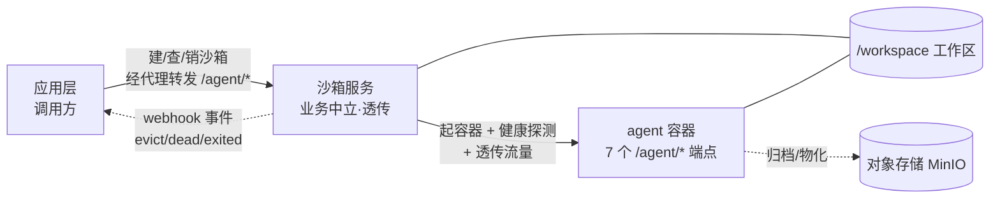
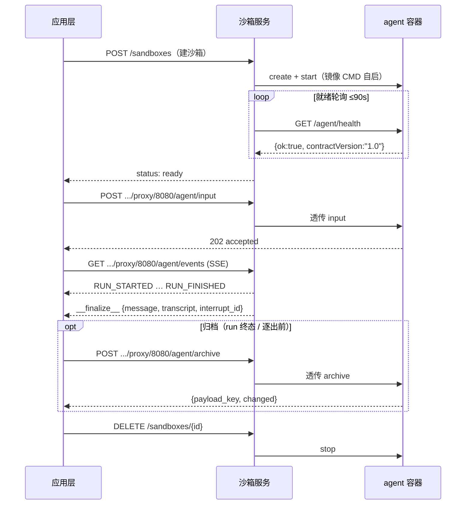
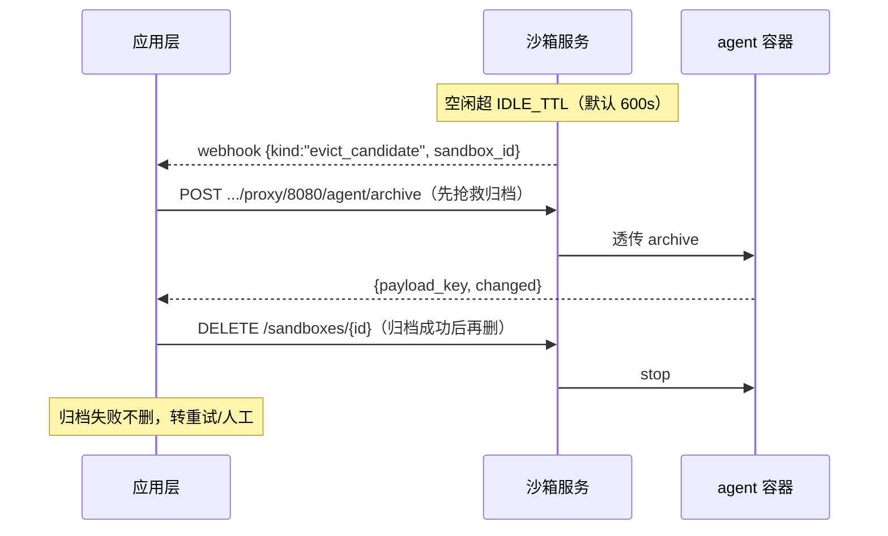

# 应用集成指南设计（Integration Guide Design）

> 状态：Draft · 日期：2026-07-29
> 交付物：两份新手友好的应用集成指南（方案 A 主线 + 方案 B 重排版）
> 依据：[`docs/agent-contract.md`](../../agent-contract.md) v1.0、[`docs/sandbox-lifecycle.md`](../../sandbox-lifecycle.md) v1.0、[`README.md`](../../README.md)、[`echo_agent/`](../../echo_agent/) 参考实现

---

## 1. 目标与原则

产出两份「新手小白也能懂」的应用集成指南，覆盖**全链路**：做合规 agent + 应用层驱动沙箱。四原则映射：

| 原则 | 落地方式 |
| --- | --- |
| 实用优先 | 只给核心操作步骤；schema 全字段、blob 去重算法、shim 路由映射表等**不进主体**，仅在速查表指向 normative 文档 |
| 可视化 | 层级关系用 mermaid **架构图**；流程步骤用 mermaid **序列图** |
| 易于理解 | 通俗表达，术语首次出现即解释；`echo_agent` 贯穿全文做运行示例 |
| AI 友好 | 末尾**契约速查表**精确可执行（端点/字段/状态码/合规项），明确指向 normative 文档，可被 coding agent 直接遵约 |

## 2. 读者与范围

### 2.1 读者
- **主**：第一次把应用/agent 接入本沙箱服务的开发者（新手）。
- **兼**：把指南丢给 coding agent、让其按契约实现/对接的开发者。

### 2.2 范围内
三层心智模型；用 `echo_agent` 跑通冒烟；做一个合规 agent；应用层建沙箱/经代理对话/回收；只改 `.env` 上线；契约速查。

### 2.3 范围外（YAGNI，不写或仅一句带过）
- 换沙箱底座（OpenSandbox 适配层）。
- 税务 `[tax]` 扩展字段语义细节（只说明「可忽略未知扩展字段、不得报错」）。
- legacy shim 路由映射表。
- 归档内容格式 / blob 去重实现细节。
- 生产运维（MinIO 集群、token 轮换流程）。

## 3. 术语
- **应用层（调用方，现网 vm1）**：驱动沙箱生命周期、经代理与 agent 对话、消费事件的一方。
- **沙箱服务（现网 vm2）**：业务中立的容器调度 + 通用代理 + 工作区快照；对协议内容零感知。
- **agent 容器**：自带入口（CMD/ENTRYPOINT）的镜像，容器内起 HTTP 服务实现 7 个 `/agent/*` 端点。
- **契约**：`agent-contract`（容器内数据面）、`sandbox-lifecycle`（沙箱北向 API）。

## 4. 交付物

| 文件 | 方案 | 说明 |
| --- | --- | --- |
| `docs/integration/beginner-integration-guide.md` | A | 主线，线性旅程，**先出** |
| `docs/integration/integration-guide-by-role.md` | B | A 定稿后的**重排版**，按角色切分，内容复用 A |

两份内容覆盖一致，差别只在编排入口（见 §5、§6）。

---

## 5. 方案 A 结构（主线 · 线性旅程）

`echo_agent` 贯穿全文做运行示例。每节配图见 §7。

| # | 章节 | 内容要点 |
| --- | --- | --- |
| 0 | 这份指南怎么用 | 谁该读、读完能干嘛、先决条件（会 Docker 基本操作、有 `SERVICE_TOKEN`） |
| 1 | 它是什么 | 一句话定位（给 agent 一个隔离容器 + 工作区，流量原样代理进去，其余不管）+ 三层各管/不管什么（小表）+ 两条契约一句话。**配架构图** |
| 2 | 先跑通参考实现 | 用自带 `echo_agent` 跑 `deploy/docker-compose.smoke.yml` + `smoke.sh`，不写代码看到全链路通（create→代理→SSE→workspace→lifecycle） |
| 3 | 做你的 agent | 3.1 交付物（自带 CMD 镜像 + 7 端点小表：方法/路径/一句话行为）；3.2 最短路径抄 `echo_agent`、列出要改的 3 处（input worker / materialize / archive）；3.3 运行环境是沙箱注入的 env（只读；身份/路径/LLM/对象存储几类；不自行持久化对话）；3.4 构建镜像（自带入口 Dockerfile 样板）；3.5 **配 run 生命周期序列图**；3.6 过 `tests/agent_conformance`，全绿=合规 |
| 4 | 应用层接线 | 4.1 鉴权与基址（Bearer `SERVICE_TOKEN`，默认 8001）；4.2 建沙箱 `POST /sandboxes`（关键字段 `id`/`env`/`callback_url`，幂等复用）；4.3 经代理对话 `…/proxy/8080/agent/input` + `events`（SSE 透传）；4.4 回收三层防线极简版（L1 退出即 DELETE / L2 空闲 webhook→先归档后删 / L3 孤儿巡检不用管）；4.5 **配回收序列图** |
| 5 | 上线 | 只改 `AGENT_IMAGE`（指向你的镜像）+ `AGENT_COMMAND` 留空，重启即生效，平台代码零改动；版本协商提醒（health 的 `contractVersion` major=1） |
| 6 | 验收清单 | 浓缩勾选式（镜像自带 CMD 且 90s 就绪 / input 202+409 / SSE 收尾 / cancel 幂等 / materialize 幂等 / archive 可恢复 + 查重 / 忽略未知字段 / conformance+smoke 全绿 / 只改 .env） |
| 7 | 契约速查表（AI 友好） | 见 §8 |

**对蓝图的精炼**：原蓝图 §4 计划「建沙箱 + 回收」两条序列图。建沙箱流程已包含在 §3.5 的 run 生命周期序列图（以 `POST /sandboxes` 开头）中，为避免重复，§4 只保留**回收序列图**一条。全篇共 3 张图（§7）。

## 6. 方案 B 结构（重排版 · 按角色切分）

架构图放最前共用，之后按角色分 Part，各读各的。内容与 A 完全复用，仅重排：

| 部分 | 章节 | 内容（= A 的哪节） |
| --- | --- | --- |
| 0 | 怎么用 + 架构图 | A §0 + A §1 |
| Part 1 | agent 构建方 | A §3 全部（含 run 生命周期序列图） |
| Part 2 | 应用层调用方 | A §4 + A §5（含回收序列图） |
| Part 3 | 契约速查表（AI 友好） | A §7 |
| 附录 | 验收清单 | A §6，按角色分组 |

---

## 7. 图表清单（3 张 mermaid，A/B 共用）

### 7.1 架构图（A §1 / B §0）

### 7.2 一个 run 的生命周期序列图（A §3.5 / B Part1）

### 7.3 回收序列图（A §4.5 / B Part2）

---

## 8. 契约速查表内容（AI 友好 · A §7 = B Part3 共用）

开头给 coding agent 一句指令：

> **给 coding agent**：实现/对接以本表为最小契约；与 normative 文档冲突时，以 [`agent-contract.md`](../agent-contract.md) / [`sandbox-lifecycle.md`](../sandbox-lifecycle.md) 为准。机器可校验 schema 见 `docs/schemas/`，样例见 `docs/fixtures/`。

**表 1 · agent-contract 7 端点**（方法/路径/成功码/错误码/一句话行为）

| 方法 | 路径 | 成功 | 错误 | 行为 |
| --- | --- | --- | --- | --- |
| GET | `/agent/health` | 200 | - | `{ok, busy, run_id, contractVersion:"1.0"}` |
| POST | `/agent/input` | 202 | 409 `run_busy`、502 `materialize_failed` | 收 RunRequest，立即 202，后台执行 |
| POST | `/agent/resume` | 202 | 同上 | 续跑（同形，宿主已编入 resume_item） |
| POST | `/agent/cancel` | 200 | - | 幂等；命中后事件流以 `RUN_CANCELLED` 收尾 |
| GET | `/agent/events` | 200 | - | SSE：`RUN_STARTED…终止事件→__finalize__→关流` |
| POST | `/agent/materialize` | 200 | 400、502 | 工作区物化，幂等（二次 `mode="skipped"`） |
| POST | `/agent/archive` | 200 | 400、502 | 归档到对象存储，返回 `payload_key` + 内容级 `changed` |

**表 2 · sandbox-lifecycle 关键端点**（鉴权：除 `GET /health` 外均需 `Authorization: Bearer <SERVICE_TOKEN>`）

| 方法 | 路径 | 行为 |
| --- | --- | --- |
| GET | `/health` | `{ok, apiVersion}`（公开） |
| GET | `/capacity` | 池统计 `{live, leased, idle, capacity, idleTtl, evict_candidates[]}` |
| POST | `/images` | 镜像预热（异步 202，幂等） |
| POST | `/sandboxes` | 创建/幂等复用；body 含 `id`/`env`/`callback_url?`/`wait_ready?` |
| GET | `/sandboxes/{id}` | 状态 `{state, running, exit_code, probe?}` |
| DELETE | `/sandboxes/{id}` | 停容器（幂等）；`{ok, terminated}` |
| ANY | `/sandboxes/{id}/proxy/{port}/{path...}` | 通用透传（含 SSE）；容器不可达 502 |
| POST | `/sandboxes/{id}/workspace/snapshot/restore` | 按 `payload_key` 恢复工作区；不存在 404 |

**表 3 · 关键注入 env**（沙箱启动注入，agent 只读）

| 变量 | 语义 |
| --- | --- |
| `AGENT_PORT` | HTTP 监听端口（缺省 8080） |
| `WORKSPACE` | 工作区路径（`/workspace`，唯一持久面） |
| `SESSION_ID` / `OWNER_ID` | 会话/归属身份 |
| `PAYLOAD_KEY` | 非空→物化走快照恢复 |
| `AGENT_TOKEN` | 会话级 token（= `LLM_API_KEY`，回调宿主 Bearer） |
| `LLM_BASE_URL` / `LLM_API_KEY` / `LLM_MODEL` | LLM proxy（永不注入真实 key） |
| `MINIO_*` | 对象存储凭据（materialize/archive 数据面直连） |

**表 4 · 合规检查项**（conformance 黑盒）
- agent 侧（`tests/agent_conformance`）：①镜像自带入口 90s 内 health `ok=true` 且 `contractVersion` major=1；②input 202 / 活跃期重复 409；③events 合法帧序 + `__finalize__` 收尾 + 正常关流；④cancel 幂等 → `RUN_CANCELLED`；⑤materialize 幂等；⑥archive 返回 `payload_key` 且可恢复 + 无变化 `changed=false`；⑦忽略未知扩展字段不报错。
- lifecycle 侧（`tests/lifecycle_conformance`）：①建沙箱就绪 + 同 id 幂等复用 + 池满 503；②代理透传普通 HTTP 与 SSE 不失真、不可达 502；③快照 restore 不存在 key → 404 且不破坏现有工作区；④文件 API 路径逃逸 403；⑤DELETE 幂等 + 状态与容器一致；⑥webhook 按约投递或轮询可见。

---

## 9. 与现有文档关系
- 本指南是**入门层**，通俗；权威细节以 `agent-contract.md` / `sandbox-lifecycle.md`（Normative）为准，速查表每节标注溯源链接。
- 不重复 schema 全文，指向 `docs/schemas/*.json` 与 `docs/fixtures/`。
- 与现有 `docs/agent-onboarding.md`（技术向 agent 接入）形成「入门 → 进阶」梯度，互相交叉引用，不替换。

## 10. 指南自身验收（done 标准）
- 新手照 A 能在不动平台代码前提下跑通 `echo_agent` 冒烟 + 过 `tests/agent_conformance`。
- 速查表端点/状态码与 normative 文档一致（人工对照）。
- 3 张 mermaid 图在 GitHub/VSCode 可正常渲染。
- B 覆盖与 A 一致，仅编排不同；两份交叉引用 normative 文档。
